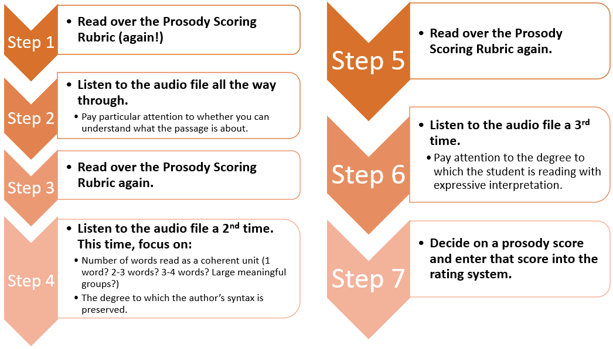

<h2 id="top" /h2>

```{r setup, include=FALSE}
knitr::opts_chunk$set(echo = FALSE,
                      wwarning = FALSE,
                      message = FALSE)

library(tidyverse)
library(ggthemes)
library(gt)
library(ggtext)
library(janitor)
library(gtsummary)
library(UpSetR)
library(english)

theme_set(theme_minimal())
```

# Purpose

Oral reading fluency (ORF), generally defined as reading quickly, accurately, and with prosody, is an essential part of reading proficiency. Prosody, reading with appropriate expression and phrasing, is one way to demonstrate that a reader understands the meaning of the text.

The purpose of this study is to collect prosody ratings of audio recordings of students’ ORF. These human-rated prosody scores will serve as the basis for training an algorithm that can be used to automatically generate prosody scores from students’ oral reading.

# Audio Recordings

Audio recordings of students in Grades 2 through 4 reading brief ORF passages were collected as part of an [IES funded project]( https://ies.ed.gov/funding/grantsearch/details.asp?ID=1492) called Computerized Oral Reading Evaluation, or [CORE]( https://jnese.github.io/core-blog/). CORE combines automatic speech recognition (ASR) to score ORF accuracy and rate, with a latent variable psychometric model to scale, equate, and link scores across Grades 2 through 4. 
The primary goal of CORE is to develop an ORF assessment system with the potential to reduce: (a) human ORF administration errors, by standardizing administration setting, delivery, and scoring; (b) the time cost of ORF administration, by allowing small-group or whole-classroom testing; (c) the resource cost to train staff to administer and score the ORF assessment; and (d) the standard error of ORF measurement.

The work conducted in the [current project]( https://ies.ed.gov/funding/grantsearch/details.asp?ID=3427) extends this line of research by incorporating prosody into the measurement model.

The [Consequential Validity Study]( https://jnese.github.io/core-blog/posts/2019-04-12-consequential-validity-study-procedures/) from the original CORE project conducted in 2017-18 and 2018-19 resulted in the accumulation of 90,720 audio files. Of these, 8,713 were excluded from the current study because they were recordings of students reading the criterion easyCBM ORF passages from the original study while the remaining 82,007 (90.4%) represented recordings of students reading brief (approximately 50-85 word) passages developed specifically for the CORE project. From the 82,007 eligible audio recordings, only those that were at least ten seconds long were selected (to screen for empty or incomplete files) for a final corpus of 78,712 audio files. 

## CORE ORF Passages

CORE passages were written by a former teacher, who also co-wrote the original easyCBM ORF and reading comprehension passages. Each CORE passage is an original work of fiction, and within 5 words of a targeted length: *long* = 85 words or *medium* = 50 words. Each passage has a beginning, middle, and end, follows either a “problem/resolution” or “sequence of events” format, and contains minimal use of dialogue and symbols. Exclusion rules for what could not appear in passages included: religious themes; trademark names, places, products; cultural/ethnic depictions; age-inappropriate themes (e.g., violence, guns, tobacco, drugs). All final CORE passages were reviewed by two experts in assessment for screening and progress monitoring for errors (e.g., format and grammatical), and bias (e.g., gender, cultural, religious, geographical). Final passages included 150 total passages, 50 at each of Grades 2-4, with 20 long passages (80-90 words), and 30 medium passages (45-55 words) for each grade.

## Audio File Selection

For the current study, a two-step process was used to select 200 audio files for 10 CORE ORF passages at each of Grades 2 through 4.

First, for each grade and passage length the 5 CORE passages with the greatest number of audio file records were selected to create as large an item bank as possible. This process resulted in the selection of 10 CORE passages (5 long and 5 medium) for each of Grades 2 – 4, 30 passages in all.

```{r student_demos}

data_ratings <- read_csv(here::here("nopublish", "data_ratings_final.csv")) %>% 
  mutate(core_id = as.numeric(str_extract(filename, "(?<=student_)(.*?)(?=_)")),
         id_passage = parse_number(batch),
         grade_core = as.numeric(str_sub(id_passage, 1, 1)))

student_audiofiles <- data_ratings %>%
  filter(!is.na(rating)) %>% 
  group_by(core_id) %>% 
  count() 

demos_easycbm <- read_csv(here::here("nopublish", "demos_easycbm.csv")) %>% 
  distinct(easycbm_id, .keep_all = TRUE)

dir_demos <-  read_csv(here::here("nopublish", "audiofile_directory_phase1_v4.csv")) %>% 
  left_join(demos_easycbm, by = "easycbm_id") %>% 
  select(-contains(".x"), -contains(".y"))

rating_demos <- data_ratings %>% 
  left_join(dir_demos, by = c("filename" = "file")) 

student_demos <- rating_demos %>% 
  distinct(core_id.x, .keep_all = TRUE) %>% 
  select(grade_core, student_gender, student_ethnicity, student_race, easycbm_sped, easycbm_ell) %>% 
  mutate(
    `Stratification Groups` = case_when(
      easycbm_ell == "y" & easycbm_sped == "y" ~ "EL & SWD",
      easycbm_ell == "y" & easycbm_sped == "n" ~ "EL only",
      easycbm_ell == "n" & easycbm_sped == "y" ~ "SWD only",
      easycbm_ell == "n" & easycbm_sped == "n" ~ "Not EL or SWD",
      TRUE ~ NA_character_),
    student_gender = recode(student_gender,
                            "F" = "Female",
                            "M" = "Male"),
    easycbm_ell = recode(easycbm_ell,
                         "n" = "No",
                         "y" = "Yes"),
    easycbm_sped = recode(easycbm_sped,
                         "n" = "No",
                         "y" = "Yes")
  )

strat <- student_demos %>%
  tabyl(`Stratification Groups`) %>%
  as_tibble() %>%
  mutate(percent = round(percent*100, 0))

# student_demos %>% 
#   summarise(
#     pct_fem = round(sum(student_gender == "F", na.rm = TRUE)/n()*100, 0),
#     pct_male = round(sum(student_gender == "M", na.rm = TRUE)/n()*100, 0),
#     miss_gend = round(sum(is.na(student_gender))/n()*100, 0),
#     pct_latinx = round(sum(student_ethnicity == "Hispanic/Latino", na.rm = TRUE)/n()*100, 0),
#   )

```

Second, stratified random sampling was applied to select 200 audio recordings of each CORE passage, oversampling for English learners (ELs) and students with disabilities (SWDs), two student groups for which the ASR may be less accurate. Of the `r nrow(student_audiofiles)` students in the full sample, approximately `r pull(filter(strat, 'Stratification Groups' == "EL & SWD"), percent)`% were dually classified as EL and SWD, `r pull(filter(strat, 'Stratification Groups' == "EL only"), percent)`% were classified as EL only, `r pull(filter(strat, 'Stratification Groups' == "SWD only"), percent)`% were classified as SWD only, `r pull(filter(strat, 'Stratification Groups' == "Not EL or SWD"), percent)`% were classified as neither EL nor SWD. 

The stratified random sampling plan led to the following quantities of sampled audio files: 5 students (2.5%) dually classified as EL and SWD, 65 students (32.5%) classified as EL only, 65 students (32.5%) classified as SWD only, and 65 students (32.5%) classified as neither EL nor SWD. A cascading logic was implemented, such that when fewer than 5 recordings included students dually classified as EL and SWD, the remainder of recordings was sampled from students classified as EL only. If there were insufficient audio recordings from EL only students, the remainder was sampled from students classified as SWD only. The remainder of audio recordings was sampled from students classified as neither EL nor SWD, of which there were ample recordings. 

The design of the project stipulated that each of the 200 audio files per CORE passage was to be rated for prosody by two different raters, for a total of 12,000 prosody ratings (10 passages * 3 grade levels * 200 recordings * 2 ratings = 12,000 total prosody ratings).

The 6,000 audio files were grouped into 120 sets of 50 for distribution to human raters. The 200 audio files per CORE passage were split into four sets, such that each set of 50 contained audio files of students reading the same passage. This structure was used to allow raters to get familiar with a passage and thus provide more reliable ratings. The PI (J. F. T. Nese) manually distributed the sets as required, descending by grade and passage such that all four sets of the first Grade 4 passage were sent to the first eight raters (as each set was rated twice), and continuing through the last Grade 2 passage.

```{r noaudio}
noaudio1 <- data_ratings %>% 
  filter(str_detect(batch, "batch")) %>% 
  mutate(rating = as.numeric(rating)) %>% 
  group_by(filename) %>% 
  summarize(missing = sum(is.na(rating))) %>% 
  filter(missing > 0)

```

Of the 6,000 selected audio files `r nrow(noaudio1)` (`r round(nrow(noaudio1)/6000*100, 0)`%) had to be replaced because they had no audio available to score; either there was no audio (e.g., the student was muted or advanced without reading), or the audio did not allow the rater to confidently give a prosody score (e.g., poor audio quality, too much background noise, a very quiet reader). All audio files were replaced with a reading from the same CORE passage. For *n* audio files that needed to be replaced for a CORE passage, *n* $\times$ 1.175 (17.5% of *n*) were sampled to account for potential audio recording with no available audio in the replacement set. An effort was made to replace audio files read by a student with the same EL/SWD classification. That is, the same cascading logic as previously described was applied, such that when the number of recordings for students dually classified as EL and SWD was less than required in our sampling plan, the remainder was sampled from students classified as EL only. If there were insufficient audio recordings from EL only students, the remainder was sampled from students classified as SWD only. Insufficient recordings led to the remainder of audio recordings being sampled from students classified as neither EL nor SWD, of which there were ample recordings. An additional `r data_ratings %>% filter(str_detect(batch, "replacement1")) %>% distinct(filename) %>% nrow()` audio files were distributed to the human raters as replacements. 

After the `r data_ratings %>% filter(str_detect(batch, "replacement1")) %>% distinct(filename) %>% nrow()` audio file replacements were scored, there remained five CORE passages that had less than 200 audio files with two different prosody ratings: three CORE passages had 199 audio files, and two had 197 audio files. For *n* (1 or 3) audio files that needed to be replaced for a CORE passage, *n* $\times$ 7 were sampled to account for potential audio recording with no available audio in the replacement set. These audio files were randomly sampled (without stratifying for ELs and SWDs) from those remaining for the respective CORE passages. 

```{r stratif}

rating_strat <- rating_demos %>% 
  mutate(
    strat = case_when(
      easycbm_ell == "y" & easycbm_sped == "y" ~ "EL & SWD",
      easycbm_ell == "y" & easycbm_sped == "n" ~ "EL only",
      easycbm_ell == "n" & easycbm_sped == "y" ~ "SWD only",
      easycbm_ell == "n" & easycbm_sped == "n" ~ "Not EL or SWD",
      TRUE ~ NA_character_)
  ) %>% 
  tabyl(strat) %>% 
  mutate(percent = round(percent*100, 0))


```

After all selected and usable audio files were rated twice, the final sample included `r format(nrow(data_ratings), big.mark=",")` audio files from `r format(length(unique(data_ratings$core_id)), big.mark=",")` students (`r format(sum(data_ratings$grade_core == 2), big.mark=",")` in Grade 2, `r format(sum(data_ratings$grade_core == 3), big.mark=",")` in Grade 3, `r format(sum(data_ratings$grade_core == 4), big.mark=",")` in Grade 4). The number of audio files per student in the final sample ranged from `r min(student_audiofiles$n)` to `r max(student_audiofiles$n)`.

```{r demos}
student_demos_tbl <- student_demos %>%
  tbl_summary(
    label = list(
      grade_core ~ "Grade",
      student_gender ~ "Gender",
      student_ethnicity ~ "Ethnicity",
      student_race ~ "Race",
      easycbm_sped ~ "Students with Disabilities (SWD)",
      easycbm_ell ~ "English Language Learners (EL)"),
    missing_text = "(Missing)",
  ) 
  # as_gt() %>%
  # gt::tab_header(
  #   title = ("Sample Demographics by Student")
  # ) %>%
  # gt::tab_options(
  #   data_row.padding = px(3),
  #   heading.title.font.size = "small",
  #   table.font.size = "12px"
  # ) 

rating_demos <- rating_demos %>% 
  select(grade_core, student_gender, student_ethnicity, student_race, easycbm_sped, easycbm_ell) %>% 
  mutate(
    `Stratification Groups` = case_when(
      easycbm_ell == "y" & easycbm_sped == "y" ~ "EL & SWD",
      easycbm_ell == "y" & easycbm_sped == "n" ~ "EL only",
      easycbm_ell == "n" & easycbm_sped == "y" ~ "SWD only",
      easycbm_ell == "n" & easycbm_sped == "n" ~ "Not EL or SWD",
      TRUE ~ NA_character_),
    student_gender = recode(student_gender,
                            "F" = "Female",
                            "M" = "Male"),
    easycbm_ell = recode(easycbm_ell,
                         "n" = "No",
                         "y" = "Yes"),
    easycbm_sped = recode(easycbm_sped,
                         "n" = "No",
                         "y" = "Yes")
  )

audiofile_demos_tbl <- rating_demos %>%
  tbl_summary(
    label = list(
      grade_core ~ "Grade",
      student_gender ~ "Gender",
      student_ethnicity ~ "Ethnicity",
      student_race ~ "Race",
      easycbm_sped ~ "Students with Disabilities (SWD)",
      easycbm_ell ~ "English Language Learners (EL)"),
    missing_text = "(Missing)",
  ) 
  # as_gt() %>%
  # gt::tab_header(
  #   title = ("Sample Demographics by Audiofile")
  # ) %>% 
  # gt::tab_options(
  #   data_row.padding = px(3),
  #   heading.title.font.size = "small",
  #   table.font.size = "12px"
  # )
```

The results of the stratification yielded a sample of `r format(nrow(data_ratings), big.mark=",")` audio files that was `r pull(filter(rating_strat, strat == "EL & SWD"), percent)`% (*n* = `r pull(filter(rating_strat, strat == "EL & SWD"), n)`) EL and SWD, `r pull(filter(rating_strat, strat == "EL only"), percent)`% (*n* = `r pull(filter(rating_strat, strat == "EL only"), n)`) EL only, `r pull(filter(rating_strat, strat == "SWD only"), percent)`% (*n* = `r pull(filter(rating_strat, strat == "SWD only"), n)`) SWD only, and `r pull(filter(rating_strat, strat == "Not EL or SWD"), percent)`% (*n* = `r pull(filter(rating_strat, strat == "Not EL or SWD"), n)`) neither EL or SWD. 

```{r demo_tbl}

tbl_merge(list(student_demos_tbl, audiofile_demos_tbl),
           tab_spanner = c(c("**By Student**", "**By Audiofile**"))) %>%  
  as_gt() %>%
  gt::tab_header(
    title = ("Sample Demographic Characteristics")
  ) %>% 
  gt::tab_options(
    data_row.padding = px(3),
    heading.title.font.size = "small",
    table.font.size = "12px"
  )

```

<a href="#top">(Back to Table of Contents)</a>


# Research Team

The [research team](link to section) comprised four faculty with expertise in the assessment of students’ reading fluency (specializations included: two doctorates in School Psychology, one doctorate in Educational Leadership with a specialization in Learning Assessment/Systems Performance, and one doctorate in Educational Psychology), and one graduate research assistant with experience in literacy. The research team met weekly from August through November 2020, to refine a prosody scoring rubric, score audio files to be used as training and demonstration exemplars, and develop two online sessions to train prosody raters. These sessions were delivered live as well as recorded for asynchronous delivery for raters who were unable to attend in person. 

<a href="#top">(Back to Table of Contents)</a>

# Prosody Rubric Development

The research team began with the prosody scoring rubric developed by the National Assessment of Educational Progress (NAEP; ^[[Daane  et al., 2005](https://nces.ed.gov/nationsreportcard/pdf/studies/2006469.pdf)]), a four-point scale (below) that focuses on phrasing, adherence to the author’s syntax, and expressiveness to assess prosody at Grade 4.  

```{r fig.cap="From [Daane, Campbell, Grigg, Goodman, & Oranje (2005)](https://nces.ed.gov/nationsreportcard/pdf/studies/2006469.pdf)", out.extra="class=external"}
knitr::include_graphics("images/naep_rubric.png")
```

Although NAEP only applied the scoring rubric to Grade 4, our research team made the decision to use the rubric across Grades 2 through 4, independent of grade and based on the absolute prosody criteria specified for each of the four prosody levels.

To help draw clear differences between the four prosody levels across grades, parts of the Multi-Dimensional Fluency Scoring Guide (MFSG; ^[[Rasinski  et al., 2009](https://www.tandfonline.com/doi/pdf/10.1080/19388070802468715)]) were incorporated into the original NAEP rubric. 

```{r fig.cap="From [Rasinski, Rikli, & Johnston (2009)](https://www.tandfonline.com/doi/pdf/10.1080/19388070802468715)", out.extra="class=external"}
#fig.width=6, fig.height=1.5
knitr::include_graphics("images/mfsg_rubric.png")
```

The MFSG focuses on assessing aspects of expression, phrasing, smoothness, pacing, and accuracy. The research team expanded and refined the NAEP prosody rubric with select parts of the MFSG to add more specific language and examples. 

A systematic process for adapting the NAEP rubric was conducted in August and September, 2020. First, 30 audio recordings were dispersed among the research team and scored individually by the four faculty. These scores and commentary were documented, analyzed, and discussed during the following week’s meetings. A summary of the team’s individual scores was presented, highlighting areas of agreement and disagreement: 9 audio files (30%) received the same score across all four raters; 13 (43%) received the same score across three raters with the fourth rating different by one prosody level; 4 (13%) were split down the middle, with two sets of identical scores that differed by one prosody level; and 4 (13%) received three different prosody scores, two of which were scored the same and two of which differed by two prosody levels. Based on inconsistent variation within the team, it was decided that more in-depth explanation was needed for each of the score levels. 

To achieve this goal, the team listened to recordings together during online meetings and iteratively specified deeper distinctions between adjacent scores using the MFSG factors of pace, phrasing, and expression and volume. The 30 audio recordings were again scored individually by the four faculty: 12 (40%) audio files (30%) received the same score across all four raters; 12 (40%) received the same score across three raters, with the fourth rating different by one prosody level; and 6 (20%) were split down the middle, with two sets of identical scores that differed by one prosody level. 

The team further refined the adapted rubric to clarify rating criteria and arrive at more unequivocal prosody scores. That is, the first version of the adapted rubric did not address whether the overall storyline was “represented” by the reader. After working through various examples, the research team added the following distinctions for each proficiency level (italic text represents additions from the MFSG, and regular text represents additions made by the research team).

* __Level 1__: *Reads slowly and laboriously.* Story line is incoherent.
* __Level 2__: *Reads moderately slowly.* Overall meaning of the text is preserved.
* __Level 3__: *Reads with a mixture of run-ons, mid-sentence pauses for breath, and some choppiness. There is reasonable stress and intonation.*
* __Level 4__: *Reads smoothly with some breaks, but self-corrects with difficult words and/or sentence structures. Reads with varied volume and expression (like talking to a friend with voice matching the interpretation of the passage).*

## The CORE + Prosody Rubric 

```{r core_rubric}
#layout="l-page"
knitr::include_graphics("images/core-ii_rubric.png")
```

## Exemplar Audio Files

After finalizing the refined rubric, the research team came to unanimous agreement on the 30 audio files. Then, additional audio files were sought with the goal of having 15 exemplar audio files for each of the four prosody levels. ORF data from the CORE project were used to find (de-identified) students whose fall easyCBM ORF scores clustered around a specified percentile; for example, students who scored at or below the 20th percentile as potential candidates for prosody scores of Levels 1 or 2, and students who scored above the 90th percentile as potential candidates for a prosody score of Level 4. Using this process, the team identified an additional 31 audio files, each of which were independently scored by two of the five research team personnel. Of these, 21 (68%) received the same score across the two raters. The remaining 10 audio files were scored by a third member of the research team, and discussed by the full research team until unanimous score agreement was achieved. Additional exemplar audio files were still needed for Levels 2 and 4, so 16 additional files were identified and underwent the same process just described. 

In total, 81 passages were identified and scored by the research team as exemplars for trainings and demonstrations: 20 at Level 4, 23 at Level 3, 15 at Level 2, and 23 at Level 1. Of these, 24 were used for Training, 25 were used for Certification (both described below), and the remaining 32 were retained in case of future need.

Human prosody raters were recruited and required to complete two [Training Sessions](link to section), and meet [Prosody Certification](link to section) criterion. 

<a href="#top">(Back to Table of Contents)</a>

# Prosody Rater Recruitment 

Educators (teachers and specialized professionals) were targeted as potential prosody raters. Potential prosody raters were recruited in October – November 2020 from two sources: teacher participants from the original CORE project, and through an announcement placed on the easyCBM - Lite and Deluxe sites for three weeks (10/19/2020 – 11/6/2020). These two easyCBM sites have over 79,000 registered users. 

<!-- > Paid Opportunity! -->
<!-- > * We're looking for Grade 2-5 teachers interested in earning a little extra money scoring oral reading for prosody (expressiveness). -->
<!-- > * All work can be done remotely on your own time. -->
<!-- > * No prior experience scoring prosody needed (we'll provide the training). -->
<!-- > * The more readings you score, the more money you will earn! -->
<!-- > * This project is part of an IES-funded research study to develop computer-scored oral reading fluency measures. -->
<!-- > * For more information, please email: -------@easycbm.com -->

Approximately 300 people responded to the announcement posted on the easyCBM sites. These respondents were then sent an email introducing them to the project, the task required of them, what they could expect (payment terms, remote work, and work commitment), training requirements, the prosody certification process, and next steps (a Qualtrics Registration form requiring demographic information, teaching experience, and a W9). <!-- Please see [Appendix A](link to section) for the introduction email. --> The PI (J. F. T. Nese) corresponded with all potential prosody raters throughout the process.

```{r traincert_data}
data_traincert <- read_csv(here::here("nopublish", "data_trainingcertification.csv"))
```

Of the 300 respondents, 119 completed the Registration form, and `r nrow(data_traincert)` completed the required trainings. (No information is available as to why some chose not to complete the Registration or the trainings.) 

# Prosody Certification

Prior to starting work, each prosody rater was required to complete the Training and demonstrate scoring proficiency by obtaining 80% or higher agreement with the research team’s pre-determined rating on two different sets of five audio files. Raters had five opportunities to achieve at least 80% (4/5) on two of the prosody assessments. Raters unable to achieve two passing scores received payment for their participation in training ($45) but were not be eligible to continue their participation in this project.

All Prosody Certification Assessments were delivered with Google Forms’ Quiz feature. All participants took the first Prosody Certification after Training #1 and before Training #2. The remaining Prosody Certification assessments were taken at each participant’s pace. Once a participant met the prosody certification criteria by scoring at least 80% on two assessments, they began scoring audio files (and took no more assessments).

Of the `r nrow(data_traincert)` people who completed the [Trainings](link to section), `r sum(data_traincert$passed == "pass")` (`r round((sum(data_traincert$passed == "pass")/nrow(data_traincert))*100, 0)`%) met prosody certification, `r sum(data_traincert$passed == "fail")` (`r round((sum(data_traincert$passed == "fail")/nrow(data_traincert))*100, 0)`%) failed to meet certification, and `r sum(data_traincert$passed == "incomplete")` (`r round((sum(data_traincert$passed == "incomplete")/nrow(data_traincert))*100, 0)`%) did not complete the certification process.

```{r traincert_tble}

results_cert <- data_traincert %>% 
  select(ends_with("score")) %>% 
  pivot_longer(
    cols = everything(),
    names_to = "test",
    values_to = "score",
    values_drop_na = TRUE
  ) %>% 
  mutate(number = parse_number(test),
         test = paste0("Certification #", number)) %>% 
  group_by(test) %>% 
  summarise(n = n(),
            Fail = sum(score < 4, na.rm = TRUE),
            `Fail (%)` = paste0(round(Fail/n*100, 0), "%"),
            Pass = sum(score >= 4, na.rm = TRUE),
            `Pass (%)` = paste0(round(Pass/n*100, 0), "%"))

results_cert %>% 
  gt() %>% 
  cols_label(
    test = "",
  ) %>% 
  tab_style(
    style = list(
    #  cell_fill(color = "#0072B2"),
      cell_text(color = "#0072B2")
    ),
    locations = cells_body(
      columns = vars(`Pass (%)`))
    ) %>% 
  tab_style(
    style = list(
    #  cell_fill(color = "#D55E00"),
      cell_text(color = "#D55E00")
    ),
    locations = cells_body(
      columns = vars(`Fail (%)`))
  ) %>% 
    tab_header(
      title = "Prosody Certification Assessment Passing Rates"
    )

```

Of the `r results_cert %>% filter(str_detect(test, "1")) %>% pull(n)` people who took `r results_cert %>% filter(str_detect(test, "1")) %>% pull(test)`, `r results_cert %>% filter(str_detect(test, "1")) %>% pull('Pass (%)')` passed by scoring 4 or 5; `r results_cert %>% filter(str_detect(test, "2")) %>% pull('Pass (%)')` of the `r results_cert %>% filter(str_detect(test, "2")) %>% pull(n)` people who took `r results_cert %>% filter(str_detect(test, "2")) %>% pull(test)` passed; `r results_cert %>% filter(str_detect(test, "3")) %>% pull('Pass (%)')` of the `r results_cert %>% filter(str_detect(test, "3")) %>% pull(n)` people who took `r results_cert %>% filter(str_detect(test, "3")) %>% pull(test)` passed; `r results_cert %>% filter(str_detect(test, "4")) %>% pull('Pass (%)')` of the `r results_cert %>% filter(str_detect(test, "4")) %>% pull(n)` people who took `r results_cert %>% filter(str_detect(test, "4")) %>% pull(test)` passed; and `r results_cert %>% filter(str_detect(test, "5")) %>% pull('Pass (%)')` of the `r results_cert %>% filter(str_detect(test, "5")) %>% pull(n)` people who took `r results_cert %>% filter(str_detect(test, "5")) %>% pull(test)` passed.

```{r traincert_plot}

data_traincert %>% 
  select(ends_with("score")) %>% 
  pivot_longer(
    cols = everything(),
    names_to = "test",
    values_to = "score"
  ) %>% 
  group_by(test, score) %>% 
  count() %>% 
  mutate(number = parse_number(test),
         test = paste0("Certification # ", number),
         color = ifelse(score >= 4, "#0072B2", "#D55E00")) %>% 
  ggplot(aes(score, n, fill = color)) + 
  geom_bar(stat = "identity") + 
  geom_text(aes(score, n, label = n, color = color), vjust = -.5) +
  scale_x_continuous(breaks = c(0:5)) +
  scale_y_continuous(limits = c(0, 35)) + 
  scale_fill_identity() +
  scale_color_identity() +
  facet_wrap(~test, nrow = 1) + 
  labs(
    x = "Score (of 5)",
    y = "Count",
    title = "Prosody Certification Assessment Results",
    subtitle = "<b style='color:#D55E00'>Failing</b> scores and 
    <b style='color:#0072B2'>passing</b> scores"
  ) +
  theme(
    plot.subtitle = element_markdown()
  )

```

# Training Development & Implementation

A two-session training for prosody raters was developed for in-person, online delivery across two meetings in November 2020. Each Training Session was delivered twice: on Friday and the subsequent Monday afternoon (after the school day had concluded), and participants could attend either the Friday or the Monday training. There was one week between Training Session #1 and Session #2. For Training Session #1, Day 1 was held on 11/13/2020 and Day 2 was held on 11/16/2020. For Training Session #2, Day 1 was held on 11/20/2020 and Day 2 was held on 11/23/2020. 

Three members of the team were present to deliver content and answer questions using Powerpoint slides presented on the Zoom platform for web-based, live interaction. All trainings were recorded via Zoom for asynchronous training for participants who could not attend one or both of the live trainings. In total, `r nrow(data_traincert)` people completed the trainings.

```{r training_tble}

data_traincert %>% 
  select(starts_with("training")) %>% 
  pivot_longer(
    cols = everything(),
    names_to = "Training Session",
    values_to = "date"
  ) %>% 
  mutate(date = recode(date,
                       `11/13/2020` = "Day 1",
                       `11/20/2020` = "Day 1",
                       `11/16/2020` = "Day 2",
                       `11/23/2020` = "Day 2",
                       "async" = "Asynchronous"
                       )) %>% 
  group_by(`Training Session`, date) %>% 
  count() %>% 
  mutate(number = parse_number(`Training Session`),
         `Training Session` = paste0("Session #", number)) %>% 
  select(-number) %>% 
  ungroup() %>% 
  pivot_wider(
    names_from = date,
    values_from = n 
  ) %>% 
  relocate(Asynchronous, .after = last_col()) %>% 
  gt() %>% 
  tab_header(
      title = "Training Sessions Attendance"
    )
```

The research team created a [website]( https://jnese.github.io/CORE-II_trainingwebsite/index.html) for participants to access training resources. The website included: the [seven-step process](https://jnese.github.io/CORE-II_trainingwebsite/#the-task) for scoring audio files; the [prosody rubric](https://jnese.github.io/CORE-II_trainingwebsite/prosody_rubric.html) as a resource to print or keep open when rating; [training materials](https://jnese.github.io/CORE-II_trainingwebsite/training_materials.html), including the presentation slides, and a recording of each Training Session; the 24 [exemplar audio files]( https://jnese.github.io/CORE-II_trainingwebsite/exemplar_audiofiles.html) from Training Session #1; the link to the scoring site; and an [About](https://ies.ed.gov/funding/grantsearch/details.asp?ID=34270) page with information about the study.

## Training Session #1

During Training Session #1 (2 hours), study logistics and key concepts were explained to potential raters. [Training](https://jnese.github.io/CORE-II_trainingwebsite/CORE_training_session1day2_FINAL.pdf) included: information about the project context; a comprehensive review of prosody; the task of rating audio recordings for prosody; an explanation of the rubric and how to rate recordings; how to earn certification as prosody rater; the expectations and payment structure; a set of 12 exemplar audio files (about one recording per prosody level for each of Grades 2 – 4); and a practice exercise, consisting of 12 exemplar audio files (three at each of the four prosody levels presented randomly) followed by a discussion of each and the qualities that made it a specific prosody level. 

Participants were also introduced to prosody scoring in partial increments of 0.5 to facilitate prosody ratings in cases of nuanced uncertainty. For example, if a rater’s prosody rating was undecided between Level 2 and 3, they could score it as a 2.5. For the purposes of the study, all half scores (i.e., 1.5, 2.5, and 3.5) were rounded down because they did not meet the threshold for a higher score. 

The Training Session #1 practice exercise involved three rounds of listening to each audio file. The purpose of the first listen was to pay attention to the passage’s general meaning so that raters would have a general sense of what the passage was about and the degree to which the student’s reading conveyed the meaning. The purpose of the second listen was to train raters to pay attention to reading style (i.e., word-by-word, awkward word groups, conversational) and to notice whether the author’s syntax was preserved. The third listen was used to train raters to pay attention to expressiveness. This step-by-step process was designed to train raters to attend to all aspects of the rubric, and not to focus exclusively on any single aspect. The team developed a seven-step guide for listening to and scoring audio recordings.

#### The Task

```{r fig.cap="", out.extra="class=external"}

```

After listening to example recordings to clarify the scale, participants were able to practice on their own. Recordings were played, and participants were asked to first think about how they would rate the recording without sharing their scores, and then they were prompted to type their prosody score for the recorded reading into the Zoom platform’s chat box feature. Participants’ reasoning for scores was discussed as a large group with research team members facilitating the discussion and using the rubric to emphasize points made. 

After Training Session #1, participants were given the first Prosody Certification assessment, which consisted of five audio files to be scored individually, on their own time, before Training Session #2 . 

Of the `r nrow(data_traincert)` people who took the Prosody Certification Assessment #1, `r sum(data_traincert$cert1_score >= 4)` (`r round(sum(data_traincert$cert1_score >= 4)/nrow(data_traincert)*100, 0)`%) passed and `r sum(data_traincert$cert1_score < 4)` (`r round(sum(data_traincert$cert1_score < 4)/nrow(data_traincert)*100, 0)`%) did not. Note that Certification #1 was taken after Training Session #1, before the entire Training process was complete.

```{r}

data_traincert %>% 
  select(cert1_score) %>%
  group_by(cert1_score) %>% 
  count() %>% 
  mutate(color = ifelse(cert1_score >= 4, "#0072B2", "#D55E00")) %>% 
  ggplot(aes(cert1_score, n, fill = color)) + 
  geom_bar(stat = "identity") + 
  geom_text(aes(cert1_score, n, label = n, color = color), vjust = -.5) +
  scale_x_continuous(breaks = c(0:5)) +
  scale_y_continuous(limits = c(0, 35)) + 
  scale_fill_identity() +
  scale_color_identity() +
  labs(
    x = "Score (of 5)",
    y = "Count",
    title = "Prosody Certification Assessment #1 Results",
    subtitle = "<b style='color:#D55E00'>Failing</b> scores and 
    <b style='color:#0072B2'>passing</b> scores"
  ) +
  theme(
    plot.subtitle = element_markdown()
  )

```

## Training Session #2

One week later, participants again met with the research team for Training Session #2 (1.5 hours). Training Session #2 consisted primarily of a review of the five audio files from Prosody Certification #1. Participants were asked to listen to an audio file, with the prosody score provided by the training facilitator, and to identify key features that justified the score. After listening to an audio file, they were asked to share in the Zoom platform’s chat box prosody rubric features (shown on the screen) of the reading that corresponded to the score. The training facilitator read aloud and discussed the relevant and important prosody score features, using the rubric to confirm scores with participants. Participants were encouraged to ask questions if they did not understand or disagreed with the prosody score. Each audio file was played multiple times (three to six) to solidify the score and rationale for the attendees. This process was repeated for each of the five audio files.

Participants were then given an [introduction](https://jnese.github.io/CORE-II_trainingwebsite/CORE_training_session2day2_FINAL.pdf) to and demonstration of the software that they would use to score the audio files for prosody if they met certification. They were also introduced to the [training website](https://jnese.github.io/CORE-II_trainingwebsite/index.html).

<a href="#top">(Back to Table of Contents)</a>

# Prosody Rating Procedures 

## Prososy Raters: Sample

```{r raters}

data_raters <- read_csv(here::here("nopublish", "data_raterdatabase.csv"))

states <- data_raters %>% 
  tabyl(state) %>% 
  left_join(
    tibble(state = state.name,
       ab = state.abb)
  ) %>% 
  group_by(n) %>% 
  summarise(states = glue::glue_collapse(ab, ", ", last = " and ")) %>%
  arrange(desc(n)) %>% 
  mutate(txt = paste0(n, " from each of ", states))
  
```

The final prosody sample included `r nrow(data_raters)` prosody raters, `r states$txt[1]`, `r states$txt[2]`, `r states$txt[3]`, `r states$txt[4]`, and `r states$txt[5]`. Nearly all (`r sum(data_raters$gender == "Female")`) raters were female, `r sum(data_raters$gender == "Non-binary")` was non-binary, and `r sum(data_raters$gender == "Choose not to respond")` chose not to response.

#### Highest Degree Earned

```{r degree}

degree <- data_raters %>% 
  tabyl(degree) %>% 
  mutate(percent = round(percent * 100, 0)) %>% 
  arrange(desc(n))

```

Among the prosody raters, `r degree[1, "n"]` (`r degree[1, "percent"]`%) earned a `r degree[1, "degree"]`, `r degree[2, "n"]` (`r degree[2, "percent"]`%) earned a `r degree[2, "degree"]`, `r degree[5, "n"]` (`r degree[5, "percent"]`%) earned a `r degree[5, "degree"]`, `r degree[3, "n"]` (`r degree[3, "percent"]`%) earned an `r degree[3, "degree"]`, and `r degree[4, "n"]` (`r degree[4, "percent"]`%) earned a `r degree[4, "degree"]`.


```{r degree_plot}
data_raters %>% 
  group_by(degree) %>% 
  count() %>% 
  ungroup() %>% 
  mutate(degree = fct_relevel(degree,
                              "Doctorate",
                              "Associate",
                              "Masters in another field",
                              "Bachelor",
                              "Masters in education")
         ) %>% 
  ggplot(aes(n, degree)) + 
  geom_col(fill = "#0072B2") +
  geom_text(aes(n, degree, label = n), hjust = -.5) +
  labs(
    x = "Count",
    y = "",
    title = "Prosody Raters Highest Degree Earned"
    ) 

others <- data_raters %>% 
  select(role_contentarea, role_other) %>% 
  pivot_longer(
    cols = everything(),
    names_to = "q",
    values_to = "response",
    values_drop_na = TRUE
  ) %>% 
  filter(str_detect(response, "Reading", negate = TRUE),
         str_detect(response, "ESOL", negate = TRUE))

read_specialist <- data_raters %>% 
  filter(role == "reading / literacy specialist" |
           str_detect(role_contentarea, "Reading"))


```

#### Professional Roles

The professional roles of the raters were as follows: 

* `r sum(data_raters$role == "special education teacher")` (`r round(sum(data_raters$role == "special education teacher")/nrow(data_raters)*100, 0)`%) were special education teachers

* `r sum(data_raters$role == "general education teacher")` (`r round(sum(data_raters$role == "general education teacher")/nrow(data_raters)*100, 0)`%) were general education teachers 

* `r nrow(read_specialist)` (`r round(nrow(read_specialist)/nrow(data_raters)*100, 0)`%) were reading/literacy specialists

* `r sum(nrow(others))` (`r round(sum(nrow(others))/nrow(data_raters)*100, 0)`%) reported as "other" 
  + (i.e., dyslexia program specialist; literacy tutor/data analyst/testing coordinator; project consultant supporting literacy, behavior and MTSS; RTI coordinator/interventionist; RTI specialist; MTSS lead; EC compliance case manager; Master's student; and undergraduate student studying elementary education)

* 3 (`r round(3/nrow(data_raters)*100, 0)`%) reported as "school psychologist | social worker | counselor | behavior specialist | etc."

* 2 (`r round(2/nrow(data_raters)*100, 0)`%) reported as "administrator | principal | district support"

* 2 (`r round(2/nrow(data_raters)*100, 0)`%) were retired, and reported their role as special educators before retirement

* 1 (`r round(11/57*100, 0)`%) an "other content area specialist" (i.e., ESOL)

#### Experience

```{r gradelevels}

grades <- data_raters %>% 
  tabyl(grade_levels) %>% 
  mutate(percent = round(percent * 100, 0)) %>% 
  arrange(desc(n))

```

Nearly all of the prosody raters (*n* = `r grades[1, "n"]`, `r grades[1, "percent"]`%) worked at the elementary school level, `r grades[2, "n"]` (`r grades[2, "percent"]`%) worked at the middle school level, `r grades[3, "n"]` (`r grades[3, "percent"]`%) worked at the high school level, 1 (2%) worked at the elementary and middle levels, 1 (2%) worked at all three levels, and 1 (2%) worked with adults.

The average years experience as an educator was `r round(mean(parse_number(data_raters$years_educator)), 0)` years (*SD* = `r round(sd(parse_number(data_raters$years_educator)), 1)`).

```{r experience_plot}

data_raters %>% 
  group_by(years_educator) %>% 
  count() %>% 
  mutate(years_educator = fct_expand(years_educator, paste0(c(0:39, "40+")))) %>% 
  ggplot(aes(years_educator, n)) +
  geom_col(fill = "#0072B2") + 
  scale_fill_discrete(drop = FALSE) + 
  scale_x_discrete(drop = FALSE, breaks = c(seq(0, 38, by = 2), "40+"), labels = c(seq(0, 38, by = 2), "40+")) +
  labs(
    x = "Years as educator",
    y = "Count",
    title = "Prosody Raters Years of Experience in Education"
  ) 

```

<a href="#top">(Back to Table of Contents)</a>

## Prosody Raters: Certification

All `r nrow(data_raters)` prosody raters met the prosody certification criteria by scoring at least 80% on two Prosody Certification Assessments. Note that Certification #1 was taken after Training Session #1, before the Training was complete.

```{r raterscert_tbl}

raters_cert <- data_raters %>% 
  select(ends_with("score")) %>% 
  pivot_longer(
    cols = everything(),
    names_to = "test",
    values_to = "score",
    values_drop_na = TRUE
  ) %>% 
  mutate(number = parse_number(test),
         test = paste0("Certification #", number)) %>% 
  group_by(test) %>% 
  summarise(n = n(),
            Fail = sum(score < 4, na.rm = TRUE),
            `Fail (%)` = paste0(round(Fail/n*100, 0), "%"),
            Pass = sum(score >= 4, na.rm = TRUE),
            `Pass (%)` = paste0(round(Pass/n*100, 0), "%"))

raters_cert %>% 
  gt() %>% 
  cols_label(
    test = "",
  ) %>% 
  tab_style(
    style = list(
    #  cell_fill(color = "#0072B2"),
      cell_text(color = "#0072B2")
    ),
    locations = cells_body(
      columns = vars(`Pass (%)`))
    ) %>% 
  tab_style(
    style = list(
    #  cell_fill(color = "#D55E00"),
      cell_text(color = "#D55E00")
    ),
    locations = cells_body(
      columns = vars(`Fail (%)`))
  ) %>% 
    tab_header(
      title = "Prosody Certification Assessment Passing Rates"
    )
```

Of the `r raters_cert %>% filter(str_detect(test, "1")) %>% pull(n)` people who took `r raters_cert %>% filter(str_detect(test, "1")) %>% pull(test)`, `r raters_cert %>% filter(str_detect(test, "1")) %>% pull('Pass (%)')` passed by scoring 4 or 5; `r raters_cert %>% filter(str_detect(test, "2")) %>% pull('Pass (%)')` of the `r raters_cert %>% filter(str_detect(test, "2")) %>% pull(n)` people who took `r raters_cert %>% filter(str_detect(test, "2")) %>% pull(test)` passed; `r raters_cert %>% filter(str_detect(test, "3")) %>% pull('Pass (%)')` of the `r raters_cert %>% filter(str_detect(test, "3")) %>% pull(n)` people who took `r raters_cert %>% filter(str_detect(test, "3")) %>% pull(test)` passed; `r raters_cert %>% filter(str_detect(test, "4")) %>% pull('Pass (%)')` of the `r raters_cert %>% filter(str_detect(test, "4")) %>% pull(n)` people who took `r raters_cert %>% filter(str_detect(test, "4")) %>% pull(test)` passed; and `r raters_cert %>% filter(str_detect(test, "5")) %>% pull('Pass (%)')` of the `r raters_cert %>% filter(str_detect(test, "5")) %>% pull(n)` people who took `r raters_cert %>% filter(str_detect(test, "5")) %>% pull(test)` passed.

```{r raterscert_fig}

data_raters %>% 
  select(ends_with("score")) %>% 
  pivot_longer(
    cols = everything(),
    names_to = "test",
    values_to = "score"
  ) %>% 
  group_by(test, score) %>% 
  count() %>% 
  mutate(number = parse_number(test),
         test = paste0("Certification # ", number),
         color = ifelse(score >= 4, "#0072B2", "#D55E00")) %>% 
  ggplot(aes(score, n, fill = color)) + 
  geom_bar(stat = "identity") + 
  geom_text(aes(score, n, label = n, color = color), vjust = -.5) +
  scale_x_continuous(breaks = c(0:5)) +
  scale_y_continuous(limits = c(0, 35)) + 
  scale_fill_identity() +
  scale_color_identity() +
  facet_wrap(~test, nrow = 1) + 
  labs(
    x = "Score (of 5)",
    y = "Count",
    title = "Prosody Certification Assessment Results",
    subtitle = "<b style='color:#D55E00'>Failing</b> scores and 
    <b style='color:#0072B2'>passing</b> scores"
  ) +
  theme(
    plot.subtitle = element_markdown()
  )

```

```{r upset_data}

expressionInput <- data_raters %>% 
  filter(passed_n >=2) %>% 
  select(ends_with("score")) %>% 
  pivot_longer(
    cols = everything(),
    names_to = "cert",
    values_to = "score"
  ) %>% 
  mutate(pass = ifelse(score >= 4, paste0("Certification #", parse_number(cert)), NA_character_)) %>% 
  select(-score) %>% 
  pivot_wider(
    names_from = cert,
    values_from = pass
  ) %>% 
  unnest() %>% 
  unite(upset, cert1_score:cert5_score, na.rm = TRUE, sep = "&") %>%
  group_by(upset) %>% 
  count() %>% 
  arrange(desc(n)) %>% 
  pivot_wider(
    names_from = upset,
    values_from = n
  )

```

The plot below shows which two Prosody Certification Assessments the raters met prosody certification. `r str_to_sentence(as.english(pull(expressionInput[1])))` raters (`r round(pull(expressionInput[1])/nrow(data_raters)*100, 0)`%) passed `r str_replace(names(expressionInput)[1], "&", " and ")`, `r pull(expressionInput[2])` (`r round(pull(expressionInput[2])/nrow(data_raters)*100, 0)`%) passed `r str_replace(names(expressionInput)[2], "&", " and ")`, `r pull(expressionInput[3])` (`r round(pull(expressionInput[3])/nrow(data_raters)*100, 0)`%) passed `r str_replace(names(expressionInput)[3], "&", " and ")`, `r pull(expressionInput[4])` (`r round(pull(expressionInput[4])/nrow(data_raters)*100, 0)`%) passed `r str_replace(names(expressionInput)[4], "&", " and ")`, `r pull(expressionInput[5])` (`r round(pull(expressionInput[5])/nrow(data_raters)*100, 0)`%) passed `r str_replace(names(expressionInput)[5], "&", " and ")`, and `r pull(expressionInput[6])` (`r round(pull(expressionInput[6])/nrow(data_raters)*100, 0)`%) passed `r str_replace(names(expressionInput)[6], "&", " and ")`.

```{r upset_fig, layout="l-body-outset"}

upset(fromExpression(expressionInput), 
      sets = c("Certification #5", "Certification #4", "Certification #3", "Certification #2", "Certification #1"),
      keep.order = TRUE,
      point.size = 2.5, line.size = 1, 
      mainbar.y.label = "Passed Certification\n on Two Assessments (count)", 
      sets.x.label = "Passed (count)",
      main.bar.color = "#0072B2",
      matrix.color = "black",
      sets.bar.color = "black",
      text.scale = 1)

```

<a href="#top">(Back to Table of Contents)</a>

## Prosody Ratings

The `r nrow(data_raters)`certified prosody raters created a profile on a project-designed Moodle site. Raters each created their own log-in information for the system. The system allowed raters to skip audio files, go back and change scores, and complete the rating in multiple sessions, stopping and re-starting as needed. In addition to the seven-point prosody scale (1, 1.5, 2, 2.5, 3, 3.5, 4), raters were also given an option to note “No audio available to score” in case there was no audio (e.g., the student was muted or advanced without reading) or the audio did not allow the rater to confidently give a score (e.g., poor audio quality, too much background noise, a very quiet reader). 

The prosody raters were instructed to first complete a Prosody Review containing four exemplar files, one at each prosody level (i.e, 1, 2, 3, 4), prior to rating their first set of audio files. The expectation was set in training that raters must complete a minimum of 50 audio files; there was no maximum. Upon completion of the first set of recordings, raters emailed PI Nese to receive another set of recordings to rate. 

In this manner, all `r format(nrow(data_ratings), big.mark=",")` audio recordings were rated by two different prosody raters from November 28, 2020 through February 8, 2021.

The median number of audio files scored by prosody raters was `r round(median(data_raters$files_scored), 0)`, with a range from `r min(data_raters$files_scored)` to `r max(data_raters$files_scored)` (*Mean* = `r round(mean(data_raters$files_scored), 0)`, *SD* = `r round(sd(data_raters$files_scored), 0)`).

```{r ratefiles_fig}

data_raters %>% 
  group_by(files_scored) %>% 
  summarize(Count = n()) %>% 
  ggplot(aes(as.factor(files_scored), Count)) + 
  geom_col(fill = "#0072B2") +
  geom_text(aes(label = Count), vjust = -.5) +
  theme(axis.text.x = element_text(angle = 90, vjust = 0.5, hjust=1)) +
  labs(
    x = "Audio Files Scored",
    y = "Raters",
    title = "Number of Audio Files Scored by Prosody Raters"
  ) 
  # scale_y_continuous(limits = c(0, 15), breaks = seq(0, 15, by = 1)) #+
  # scale_x_continuous()

```


<a href="#top">(Back to Table of Contents)</a>

## Acknowledgments {.appendix}

This is a place to recognize people and institutions. It may also be a good place
to acknowledge and cite software that makes your work possible.

## Author Contributions {.appendix}

We strongly encourage you to include an author contributions statement briefly 
describing what each author did.

<!-- ## Appendix A {.appendix} -->

<!-- > Thank you for expressing interest in the CORE II Prosody Study! My name is Joe Nese, I am an education researcher at the University of Oregon, and I am leading the project. -->

<!-- > **Task:** -->
<!-- > For this project, we have thousands of audio files from students in Grades 2-4, reading very short passages (less than 90 seconds each). We need educators (you!) to listen to these audio files and rate them for prosody – the expressiveness with which the student read the passage. These scores will serve as the basis for our subsequent study to automatically generate prosody scores, which will provide teachers with important information about their students’ reading. All of the audio files were collected in a previous research study. -->

<!-- > **What to expect:** -->
<!-- > You will be paid $1.25 for every passage you rate. Each passage is no more than 90 seconds in length, and we expect you will listen to a passage 2-3 times before you submit your rating. You can make up to $25 per hour if you are working carefully and efficiently. Payment will not be processed until all work is complete (i.e., all audio files are scored), but no later than April 30, 2021. -->

<!-- > You will work remotely, from your computer! We have an online system so that you can log in and listen to and score the audio files assigned to you. The work will start in November and continue until all audio files are scored. This could take several weeks, or several months, depending on how quickly everyone works. Regardless, you can work on your own time. But we ask that if you sign up, you commit to scoring at least 100 audio files (approximately 5-7 hours of work). You must score at least 50 passages before any payment will be remitted.  -->

<!-- > **Before you begin:** -->
<!-- > Before you start, you will need to attend two trainings (about 3-4 hours, total), where we will teach you everything you need for this project. You will be paid $15/hour for the training sessions. You will also need to demonstrate proficiency in rating prosody by scoring 80% or higher on two different sets of audio files which have previously been scored by the research team. If you do not meet the criteria, you will not be eligible to participate in the project (but you will be paid for attending the trainings, of course).  -->

<!-- > We have scheduled two dates for each of the two required trainings sessions. You may choose either of the two dates listed for each training, but you must attend both Training Session #1 and Training Session #2.  -->
<!-- > * Training Session #1: Nov 13 or Nov 16 3:30-5:30 Pacific -->
<!-- > * Training Session #2: Nov 20 or Nov 23 3:30-5:00 Pacific -->

<!-- > If you are interested in participating in this project, please click the link below to enroll! You will answer some questions about yourself, sign up for training dates, and importantly, submit a W9 so that you can be paid for your work. You cannot join the project without completing and submitting the W9. The blank W9 is embedded in the survey, and also attached here. It will likely be easier to complete the attached W9 before you start the survey so that it is ready to upload. -->

<!-- > Click the link below to sign-up! -->

<!-- > Thank you so much for your interest in partnering with us on this important work. We are grateful for all you do on behalf of children. -->