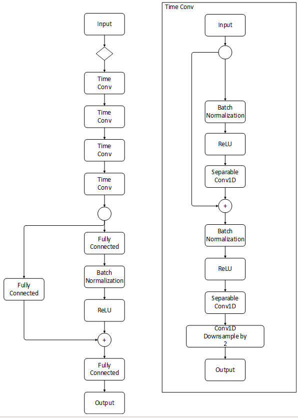
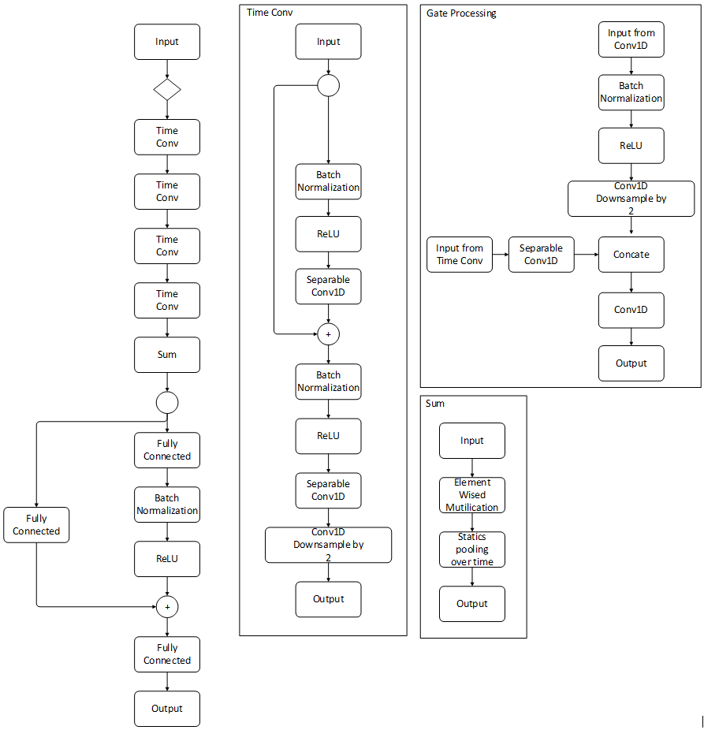
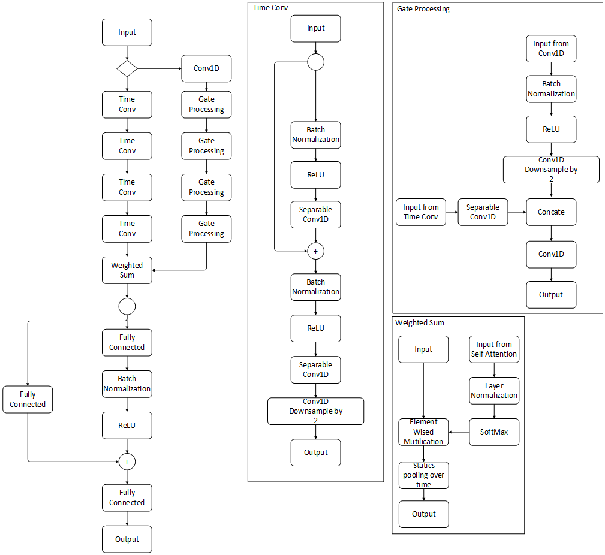
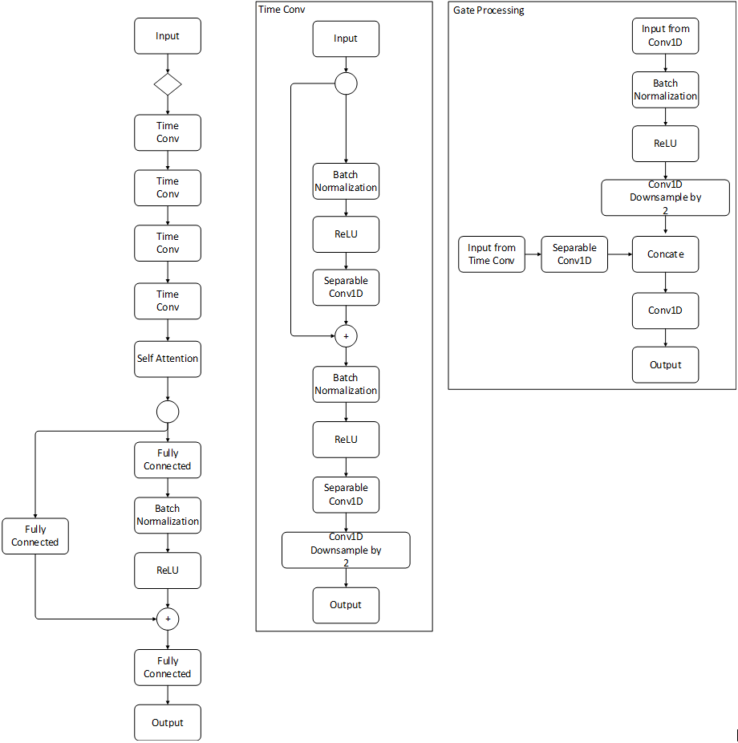
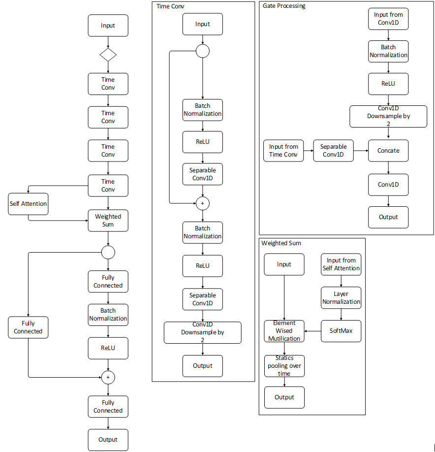

```{r setup, include=FALSE}
knitr::opts_chunk$set(echo = FALSE)

library(tidyverse)
library(kableExtra)
```

# Purpose

We use machine learning - a convolutional network - to develop an automated system to score prosody. We leverage data from our [human-rated prosody study](https://jnese.github.io/coreprosody/human_prosody_scoring.html) to inform the design and evaluate our machine learning model. Our features consist of traditional hand-engineered features, as well as learned features that comprise a convolutional neural network. That is, a convolutional network is designed to extract features from raw data in an automated fashion, independent of human effort, which is an important advantage. Once trained, this prosody scoring algorithm will be integrated into a mobile toolkit and a mobile application for displaying passages and assessing reading fluency and comprehension. 

We divide the discussion of our modeling process into the following four sections. First, we introduce related work that guided many of our proposed architectural modeling attempts and dataset processing. Based on this literature review, we then introduce modeling technologies that we believe enhance the performance of the model via leveraging advances in the field of machine learning; specifically, in convolutional networks applied to speech. Third, we investigate methods for comparing these advances in a combined implementation of convolutional and traditional processing techniques. Finally, we conclude with a discussion of other efforts, challenges, and future work. 

A subset of the efforts described here have been selected for publication in ICASSP 2022, a premiere venue for work in speech processing.

**George Sammit, Zhongjie Wu, Yihao Wang, Zhongdi Wu, Akihito Kamata, Joe Nese, and Eric C. Larson (2022). _Automated Prosody Classification for Oral Reading Fluency with Quadratic Kappa Loss and Attentive X-vectors._ International Conference on Acoustics, Speech, and Signal Processing (ICASSP 2022), Singapore.**

# Related Works

Project LISTEN [@hauptmann1994], a reading tutor that began in the 1990s, is regarded as seminal research on automated analysis of children’s spoken reading. Much research in this field builds upon it. Ananthakrishnan and Narayanan [-@ananthakrishnan2009] propose augmenting automatic speech recognizers (ASR) by adding symbolic alphabet annotations of prosodic events. Mostow and Duong [-@mostow2009] and then Duong, et al. [-@duong2011] compared a child’s oral reading to that of an adult (of the same text) by analyzing the contours in pitch, intensity, pauses, and word reading times. 

In terms of scale, the closest to ours is the work of Sitaram and Mostow [-@sitaram2012], which builds on @duong2010 who mined Project LISTEN’s database to evaluate oral prosody in an effort to predict fluency and comprehension. Bolaños et al. [@bolanos2013speechcom; @bolanos2013jep] combine lexical and prosodic features to analyze children’s oral reading based on the NAEP rating scale [@danne2005], a more standard and recognized scale than earlier studies. The most recent work in this area is from Sabu and Rao [-@sabu2018], who build a reading tutor for identifying lexical and prosodic miscues during oral reading similar to those identified by a trained professional. 

A number of works have investigated prosody correctness classification in this domain. Bolaños et al. [-@bolanos2013speechcom; -@bolanos2013jep], using a similar rating scale, achieved lexical accuracy of 73.24% and prosodic accuracy of 69.73%, when compared with human ratings. Aside from surpassing this benchmark, we introduce a number of novel concepts.

1.	We use the concept of inter-rater reliability in our loss function [@delatorre2018] and leverage a number of concepts from X-vectors [@snyder2018] and attentive X-vectors [@okabe2018]. 

2.	We employ weighted temporal pooling in our convolutional networks. 

**We summarize our contributions as follows:**

1.	We collected and validated a dataset of prosody correctness classification of 5,841 phrases collected from 1,335 students in 2nd through 4th grade. 

2.	We introduce the concept of average difference feature extraction, whereby the "ideal" prosody of a known phrase is estimated using text-to-speech (TTS) models.

3.	We evaluate the use of weighted temporal pooling, inspired by X-Vectors [@okabe2018], and weighted Kappa loss [@delatorre2018] in prosody correctness classification. 

4.	We conduct an ablation study to investigate the overall importance of each processing procedure.

Our work not only builds upon the aforementioned works, but also differs in several respects. First, our goal is solely to assess prosody according to a [novel 4-scale rubric](https://jnese.github.io/coreprosody/human_prosody_scoring.html#the-core-prosody-rubric) using conventional neural networks. Similar to many of these studies, our automated assessment is compared against expert judgement; however, we incorporate the disagreement of those judges into our model. Our sample size is considerably larger than previous studies both in terms of recordings and participants. While previous studies have informed our feature selection, we concentrate on both functional and prosodic low-level descriptors (LLDs) in the audio signal. 

# Dataset

*A full description of the procedures for the data can be found [here](https://jnese.github.io/coreprosody/human_prosody_scoring.html)*

In order to design and evaluate our prosody classification algorithm, we collected audio samples of oral readings from a variety of schools in the Pacific Northwest region of the USA. (See [here](https://jnese.github.io/core-blog/posts/2019-04-12-consequential-validity-study-procedures/) for study procedures.) Passages were written by an expert who also co-wrote the original easyCBM oral reading fluency [@alonzo2007prf] and reading comprehension passages [@alonzo2007rc]. Each passage is an original work of fiction, and within 5 words of a targeted length: long = 85 words or medium = 50 words. Each passage: has a beginning, middle, and end; follows either a "problem/resolution" or "sequence of events" format; and contains minimal use of dialogue and symbols. 

Although NAEP [@danne2005] applied the prosody scoring rubric to Grade 4, our research team made the decision to use the study-generated rubric and grade-calibrated passages which focus on phrasing, adherence to the author’s syntax, and expressiveness to assess prosody across Grades 2 through 4. In total, 49 audio samples were identified and scored by the research team as exemplars and used for training annotators and for certification of raters. A total of 63 human prosody raters were recruited and completed two training sessions, meeting the prosody certification. Raters score prosody on a 4-point prosody scale, with the option to score between integers if they are uncertain, thus creating a 7-point scale (1, 1.5, 2, 2.5, 3, 3.5, 4). Independent scores were averaged before taking the floor to provide the final score. 

Audio samples were reviewed by 138 groups of raters paired randomly in batches of approximately 50. Each rater scored between 38 and 747 recordings (Mean = 217.7, *SD* = 177.3). Initial analysis of the ratings showed inter-rater agreement of 95.8% within 1.0 point of disagreement (42.5% within 0.0; 31.2% within 0.5; 22.1% within 1.0). Disagreement of larger than 1.0 was deemed abnormal by the expert author and held-out for re-review (255 samples). In this manner, 5,841 audio recordings, each scored by two raters, were made available for model training. Given the inherent ordinal nature of these classifications, intra-class correlation (ICC) was used to validate acceptability of rater agreement [@hallgren2012; @gisev2013]. An acceptable mean of 0.74 (*SD* = 0.12) on the 7-point scale and Mean = 0.71 (*SD* = 0.12) on the final 4-point scale was observed.

In order to enhance model training result, we balanced amount of data with different scores using data augmentation. Training samples were augmented by:

1. adding Gaussian noise
2. adjusting gain
3. applying a high/low/band-pass filter using the [`audiomentations`](https://github.com/iver56/audiomentations) Python library 

Augmentation was applied randomly over a range of the adjustments taking care not to distort the student's voice. Less frequent classes were over-sampled to ensure balanced classes. In total, 4,128 new samples were added to functional training data (100% increase) and 14,092 new samples were added to LDD training data (240% increase).

From these samples, we used two kinds of features for model training. (1) Functional, summary data of the entire recording, were extracted with the 2016 Computational Paralinguistics Challenge - **CompArE** - [@weninger2013; @schuller2014]. And (2) low-level descriptors (LLDs), individual features taken every 100th of a second, were extracted using both the Extended Geneva Minimalistic Acoustic Parameter Set - **eGeMAPS** [@eyben2015] - and the CompArE. A model without augmented functional data is used during the first part of training process to give a clear overview of augmented effect. Of all LLDs available, training is first done with sub-section data and then combined into the full result. We obtain three sub-sections together that made up full LLDs data. Based on our literature review, we believe the following to be the most relevant to prosody classification.

**1.	Functional(CompArE)**
* Quartile
* Inter-quartile range
* Percentile
* Position of min and max
* Relative duration LLD related
* Mean, max, mean, and standard deviation of segment length 
* Gain of linear prediction (LP) 
* Coefficient

**2. eGeMaps**
* Frequency-related (voicing-related) time series features
  + Logarithmic F0 on a semitone frequency scale, starting at 27.5 Hz (semitone 0) 
  + Centre frequency and bandwidth of first, second, third formant 
* Energy-related frequency features, as they tend to be prosodic in nature (each of these features can be processed with a classical measure or via a convolutional filter)
  + Estimate of perceived signal intensity from an auditory spectrum 
* Spectral-related pitch features, as we expect them to allow for consistent comparisons (these features can be captured from the mel-scaled spectrogram using one dimensional convolution (across time))
  + Linear regression slope of the logarithmic power spectrum within the band 
  + Mel-Frequency Cepstral Coefficients
  + Difference of the spectra of two consecutive frames
  + Formant 1, 2, and 3 relative energies, as well as the ratio of the energy of the spectral harmonic peak at the first, second, third formant’s center frequency to the energy of the spectral peak at F0 
  + Ratio of energy of the first F0 harmonic (H1) to the energy of the second F0 harmonic (H2) and the highest harmonic in the third formant range (A3)

**3. CompArE**
* Energy-related time series features, as they tend to be prosodic in nature (each of these features can be processed with a classical measure or via a convolutional filter)
  + Sum of auditory spectrum (loudness)
  + Sum of RASTA-style filtered auditory spectrum
  + RMS energy, zero-crossing rate
* Spectral-related frequency features as we expect them to allow for consistent comparisons (these features can be captured from the mel-scaled spectrogram using one dimensional convolution (across time))
  + RASTA-style auditory spectrum, bands 1–26 (0–8kHz)
  + Mel-frequency cepstral coefficients (MFCCs)
  + Spectral energy 250–650 Hz, 1 k–4 kkHz
  + Spectral flux, centroid, entropy, slope
  + Psychoacoustic sharpness, harmonicity
  + Spectral variance, skewness, kurtosis
* Voicing-related (F0) pitch features
  + subharmonic summation (SHS)
  + Viterbi smoothed scaling (across consonants, fricatives, and plosives)

Note that, for CompArE, we also have the delta (defined as $LDD⁄\Delta LDD$) of the above features to capture not only the magnitudes but also the relative changes. In addition, the following functions may be applied to the above LLD. 

* Mean value of peaks
* Mean value of peaks – arithmetic mean
* Mean/SD of inter-peak distances
* Amplitude means of peaks, of minima
* Amplitude range of peaks
* Mean/SD of rising/falling slopes
* Linear regression slope, offset, quadratic error

# Modelng

We use the previously described pre-processed dataset as training data for modeling. To analyze each model, the result must be compared to human scoring results through a loss function. Most works use the Categorical Cross Entropy (CCE) as a loss function, which is a classic loss function for many classification tasks. However, due to the nature of prosody scoring, classes have a quantitative relation between each other that CCE cannot represent. Therefore, we also conducted experiments with a modified version of loss function: Quadratic Weighted Kappa [QWK; @delatorre2018].

QWK loss is related to the calculation of Inter-Rater Reliability (IRR) that is typically measured between two human raters. QWK quantifies the seriousness of the disagreement between human rating and model output as:

$$
\kappa = 1 - \frac{\Sigma_{i, j} \; \omega_{i, j} \; O_{i, j}}{\Sigma_{i, j} \; \omega_{i, j} \; E_{i, j}}
$$
Where $O$, $\omega$, and $E$ are the confusion matrix, penalty weights matrix, and outer product of histogram of raters, respectively.

$O$, the confusion matrix, corresponds to the number of answers that receive a score $i$ by the first rater and a score $j$ by the second rater.

A quadratic penalty weight matrix can be expressed as:

$$
\omega_{i, j} = \frac{(i - j)^2}{(N - 1)^2}
$$
where $N$ is the total number of possible classes. Matrix $O$ and matrix $E$ are normalized to sum to 1.

When optimizing with QWK, de La Torre et al. [-@delatorre2018] showed that the problem can be reformed as a minimization problem of $L$ by:

$$
L = log(1 - \kappa + \epsilon)
$$
where $L \in (-\infty, log(2))$ since $\kappa \in [-1, 1]$, the log serves to decouple the numerator and denominator calculations, which in turn eases the computation of the gradient [@delatorre2018]. The $\in$ is a small value that avoids calculating $log(0)$ for the loss function. In our dataset, we use the multiple scores from multiple raters as ground truth. When there is disagreement among raters, the QWK allows the loss to consider this disagreement. We hypothesize that such behavior is advantageous for prosody classification. 

We use AdamW optimizer [@loshchilov2017decay] to modify the learning rate.

## Functional

We employ a baseline network that uses residual connections with dense layer (Figure 1). 

```{r fig.cap="Baseline network model for functional feature.", fig.align='center'}
#fig.width=6, fig.height=1.5
knitr::include_graphics("images/functional.PNG")
```

A cosine learning rate schedule [@loshchilov2016sgdr] is applied to adjust the running rate during the training process. Both augmented data and not-augmented data is used during the training. This baseline network configuration is a common form of processing for features that are in a consistently sized vector (such as a table data). This network processes the fixed size vectors from the features generated. That is, this network is capable of processing features that have been aggregated per utterance. However, it cannot process the features over time before aggregation. For this style of processing, a convolutional network is required. 

## Low Level Descriptor Convolutional Processing

Convolutional networks (for audio) are neural networks that apply filters across the time series, extracting patterns in the audio streams over fixed time intervals. These filters are "learned" filters—meaning they are updated in the optimization process of the neural network. Because the filters are optimized, the network is optimized to extract the best sets of features from the time series. This process was previously done with expert supervision of the features extracted—a time consuming process. Thus the use of convolutional layers allows a neural network to learn to identify patterns of interest and then classify the outputs of these patterns. One downside of these networks, however, is that convolutional filters must process fixed length inputs. That is, all audio files must be the same length—that is until the use of X-vectors [@okabe2018].

In our design, we borrow concepts from X-Vectors [@snyder2018] and attentive X-Vectors [@okabe2018] for use in our architectures. These original works used convolutional networks with adaptive statistics pooling layers. These adaptive pooling layers collapse the convolutional output filters over time using simple statistics such as mean and standard deviation. Thus, regardless of the length of the input, it can be processed by filters and collapsed to a fixed length vector. This means the same networks can be trained on audio of nearly any length. Intuitively, these network learn features of the audio, and then use statistics to characterize how these features change (or are distributed) over time. These characterizations are then used to classify how the feature changes can be mapped to the classification task of interest. In our case, we seek to map the changes to meaningful classification of prosody. The original X-vectors architecture was employed for speaker authentication—learning how the feature changes can characterize a person’s voice. From that perspective, the convolutions learned by our architecture are quite different than the original X-vector architecture. 

We do not employ the time-context layers in our work—we only build variations of temporal pooling methods that weight the convolution output activations before mean ($\mu$) and variance ($\sigma^2$) are calculated into an embedding. We hypothesize the use of different temporal weighting schemes can help the model learn to ignore insignificant phrasal breaks in the spoken passage, while emphasizing other more costly prosodic mistakes. Several model architectures are constructed and investigated, described in the following sections. 

### CNN Baseline

We employ a baseline network that uses residual connections with identity mappings [@he2016] and 1D time convolution, as shown in Figure 2. Each time convolutional block uses a number of separable and strided convolutions for downsampling. This baseline network does not use any temporal pooling before entering the output flow of the network. That is, the pooling layer is replaced by a flattening operation. This network does not use the statistics pooling from X-vectors and is therefore dubbed a "baseline" because it uses traditional processing.

```{r fig.cap="Baseline network model for ComPArE and eGeMaps LLD features.", fig.align='center'}
#fig.width=6, fig.height=1.5

```

### Original X-vector

We employ an X-vector-based network that uses traditional $\mu$ and $\sigma^2$ pooling of the convolutional output activations over time. Note that there is no silence detection employed as pauses are critical for the classification of prosody. 

```{r fig.cap="Network model with Original X-vector for ComPArE and eGeMaps LLD features.", fig.align='center'}
#fig.width=6, fig.height=1.5

```

### Weighted X-vector

We employ a novel weighted X-vector architecture that uses the processing gate blocks to multiply the $\mu$ and $\sigma^2$ before pooling. This weighting is achieved through multiple 1D convolutions followed by a softmax layer to force the network to focus on certain time segments before entering the output flow. The weights are learned by the network and multiplied through the extracted features in the network. This has the effect of allowing the network to focus on certain areas over time, while ignoring other time segments. We hypothesized that this weighting would allow the network to learn feature variations that are critical for prosody, while ignoring other pauses and sentence structures that are not critical. A potential downside of this approach is that the weighting scheme requires the network to learn many more parameters. Thus, the optimization may be more difficult or unstable. To investigate this, we also propose a number of other weighting schemes that can be learned with fewer parameters, but can also be less expressive in how they tune the network. 

```{r fig.cap="Network model with Weighted X-vector for ComPArE and eGeMaps LLD features.", fig.align='center'}
#fig.width=6, fig.height=1.5

```

### Self-Attention Only

We employ a network using convolutional self-attention instead of temporal pooling, as shown in the Figure 5. Self-attention is similar to the weighted X-vector architecture except that the weighting layer is derived from the same processing branch as the input stream, rather than a separate branch. In this way, weights can still be used to weight time segments differently, but it is assumed the features used for classification are also the same features needed for weight classification. Thus, this network may not converge because the features in the feed forward branch are not sufficient for both tasks. 

```{r fig.cap="Network model with self-attention weight for ComPArE and eGeMaps LLD features.", fig.align='center'}
#fig.width=6, fig.height=1.5

```

### Self-Attention X-Vector

Finally, we employ a self-attention weighted X-vector architecture that uses portions of both self attention and weighted X-vectors (Figure 6). Here self-attention is used to calculate the weighted vector to weight the segment before pooling, rather than the gate process blocks in method above. 

```{r fig.cap="Network model with self-attention weighted X-vector for ComPArE and eGeMaps LLD features.", fig.align='center'}
#fig.width=6, fig.height=1.5

```

# Result Comparison

A summary of the performance of each architecture on each dataset is presented in the tables below, where each row represents a separate trained model (Functional with baseline only), and each "loss" column indicates whether the model was trained using CCE loss or QWK loss (Kappa-loss). The "In-Domain" results show performance using known phrases in the training set. The "Cross-Domain" results show performance using phrases that do not exist in the training set. In both scenarios, the training and testing sets are separated according to students (as previously described) such that a student is never in both the training and testing sets. For performance, the overall accuracy is shown for classifying prosody into a 4-point scale, as well as inter-rater reliability (IRR, linear $\kappa$) assuming that the model is another prosody rater. We use the average of human raters as a ground truth for accuracy and IRR. The best performing models per-domain employ self-attention only and weighting with self-attention, respectfully. 

## Functional Baseline Classification

Functional models are trained with functional data and with the baseline model only. Tables 1 and 2 below shows the results of training on not-augmented and augmented data, respectively. The augmented data gives better performance on both CCE loss and QWK loss, which failed during not-augmented, cross-domain training. The best performance is found in augmented, in-domain training, with CCE loss of 89.3% accuracy and 0.87 IRR (Table 2). Also, functional models show a relatively better performance in cross-domain results with about 62.8% accuracy and 0.53 IRR, which is the best cross-domain performance in all of the models. Because of the relatively poor cross-domain performance, we conclude that the models learned should be passage specific. Cross-domain classification is still an open research problem.

```{r}
tibble(
  Loss = c("CCE Loss", "Kappa-Loss"),
  Accuracy = c("**60.3**%", "4.0% (failed)"),
  IRR = c("**0.52**", "0.00 (failed)"),
  Acc1 = c("--", "--"),
  IRR1 = c("--", "--")
) %>% 
  kable(
    col.names = c("Loss", "Accuracy", "IRR", "Accuracy", "IRR"),
    booktabs = TRUE,
    caption = "Functional: Full-Delta Not Augmented"
  ) %>% 
  add_header_above(c(" ", "In-Domain" = 2, "Cross-Domain" = 2))
```

  
----
  

```{r}
tibble(
  Loss = c("CCE Loss", "Kappa-Loss"),
  Accuracy = c("**89.3**%", "68.7%"),
  IRR = c("**0.87**", "0.63"),
  Acc1 = c("**62.8%**", "55.2%"),
  IRR1 = c("**0.53**", "0.44")
) %>% 
  kable(
    col.names = c("Loss", "Accuracy", "IRR", "Accuracy", "IRR"),
    booktabs = TRUE,
    caption = "Functional: Full-Delta Augmented"
  ) %>% 
  add_header_above(c(" ", "In-Domain" = 2, "Cross-Domain" = 2))
```

## LLDs

For LLD models, eGeMaps voicing gives out the best performance for in-domain using weighted X-vector with CCE loss with 90.4% accuracy and 0.90 IRR (Table 4), which is also the best in-domain performance across all models. Weighted X-vector with self-attention provides relatively good performance for cross-domain data using ComPArE voicing, with Kappa loss at 58.5% accuracy and 0.43 IRR (Table 4), but the original X-Vector has a higher Kappa-loss for cross-domain with 0.46 IRR. Full eGeMaps and ComPArE does not fit well with the new model, with the best performance in eGeMaps full baseline only at 87.2% accuracy and 0.85 IRR (Table 6). The ComPArE full models were never able to fully converge and thus we cannot draw conclusions about their performances. (These are still under adjustment on both the learning rate algorithm and model itself.) We found that for cross-domain, QWK loss performs better than CCE loss in both accuracy and IRR, even if accuracy and IRR are still far from satisfactory. This results might yield ideas for future studies.

  
----
  

```{r layout="l-body-outset", fig.align='center'}
tibble::tribble(
                           ~Classifier,        ~Loss, ~Accuracy,  ~IRR, ~Accuracy, ~IRR,
                            "Baseline",   "CCE Loss",   "80.6%",  "0.76",   "45.8%", "0.27",
                            "", "Kappa-Loss",   "68.7%",  "0.69",   "47.7%", "0.36",
                            "X-Vector",   "CCE Loss",   "82.8%",  "0.80",   "50.1%", "0.34",
                            "", "Kappa-Loss",   "81.5%",  "0.79",   "48.0%", "0.31",
                   "Weighted X-Vector",   "CCE Loss",   "75.9%",  "0.70",   "46.6%", "0.27",
                   "", "Kappa-Loss",   "80.4%",  "0.78",   "56.4%", "0.42",
           "X-Vector + Self-Attention",   "CCE Loss",   "**86.4%**",  "**0.84**",   "52.6%", "0.39",
           "", "Kappa-Loss",   "74.9%",  "0.73",   "57.2%", "0.44",
  "Weighted X-Vector + Self-Attention",   "CCE Loss",   "77.9%",  "0.73",   "48.5%", "0.30",
  "", "Kappa-Loss",   "79.5%",  "0.77",   "**60.2%**", "**0.46**"
  ) %>% 
  kable(
    col.names = c("Classifier", "Loss", "Accuracy", "IRR", "Accuracy", "IRR"),
    booktabs = TRUE,
    caption = "ComPArE Voicing Model"
  )  %>% 
  add_header_above(c(" ", " ", "In-Domain" = 2, "Cross-Domain" = 2)) 
```

  
----
  

```{r layout="l-body-outset", fig.align='center'}
tibble::tribble(
                           ~Classifier,        ~Loss,    ~Accuracy, ~IRR,    ~Accuracy, ~IRR,
                            "Baseline",   "CCE Loss", "85.4%", "0.85", "51.3%", "0.33",
                                    "", "Kappa-Loss", "69.5%", "0.66", "54.4%", "0.37",
                            "X-Vector",   "CCE Loss", "75.7%", "0.74", "50.1%", "0.32",
                                    "", "Kappa-Loss", "71.7%", "0.72", "57.1%", "**0.46**",
                   "Weighted X-Vector",   "CCE Loss", "**90.4%**", "**0.90**", "50.5%", "0.32",
                                    "", "Kappa-Loss", "73.2%", "0.75", "54.5%", "0.42",
           "X-Vector + Self-Attention",   "CCE Loss", "62.3%", "0.57", "47.0%", "0.26",
                                    "", "Kappa-Loss", "73.0%", "0.73", "**58.5**%", "0.43",
  "Weighted X-Vector + Self-Attention",   "CCE Loss", "89.3%", "0.89", "52.0%", "0.34",
                                    "", "Kappa-Loss", "72.1%", "0.74", "55.4%", "0.40"
  ) %>% 
  kable(
    col.names = c("Classifier", "Loss", "Accuracy", "IRR", "Accuracy", "IRR"),
    booktabs = TRUE,
    caption = "eGeMaps Voicing Model"
  )  %>% 
  add_header_above(c(" ", " ", "In-Domain" = 2, "Cross-Domain" = 2)) 

```

  
----
  

```{r layout="l-body-outset", fig.align='center'}
tibble::tribble(
                           ~Classifier,        ~Loss, ~Accuracy, ~IRR, ~Accuracy, ~IRR,
                            "Baseline",   "CCE Loss",   "37.7%", "--",   "32.9%", "--",
                                    "", "Kappa-Loss",   "36.3%", "--",   "**36.1%**", "--",
                            "X-Vector",   "CCE Loss",   "37.2%", "--",   "32.6%", "--",
                                    "", "Kappa-Loss",   "**39.3%**", "--",   "38.0%", "--",
                   "Weighted X-Vector",   "CCE Loss",   "37.3%", "--",   "30.1%", "--",
                                    "", "Kappa-Loss",   "21.9%", "--",   "22.0%", "--",
           "X-Vector + Self-Attention",   "CCE Loss",   "35.9%", "--",   "29.8%", "--",
                                    "", "Kappa-Loss",   "33.1%", "--",   "34.2%", "--",
  "Weighted X-Vector + Self-Attention",   "CCE Loss",   "35.6%", "--",   "33.7%", "--",
                                    "", "Kappa-Loss",   "33.6%", "--",   "33.1%", "--"
  ) %>% 
  kable(
    col.names = c("Classifier", "Loss", "Accuracy", "IRR", "Accuracy", "IRR"),
    booktabs = TRUE,
    caption = "ComPArE Full Model"
  )  %>% 
  add_header_above(c(" ", " ", "In-Domain" = 2, "Cross-Domain" = 2)) 

```

  
----
  

```{r layout="l-body-outset", fig.align='center'}
tibble::tribble(
                           ~Classifier,        ~Loss, ~Accuracy, ~IRR, ~Accuracy, ~IRR,
                            "Baseline",   "CCE Loss",  "**87.2%**", "**0.85**",  "46.1%", "0.26",
                                    "", "Kappa-Loss",  "62.7%",  "0.60",  "47.8%", "0.31",
                            "X-Vector",   "CCE Loss",  "81.1%", "0.77",  "45.2%", "0.24",
                                    "", "Kappa-Loss",  "59.3%", "0.57",  "48.7%", "0.35",
                   "Weighted X-Vector",   "CCE Loss",  "73.8%", "0.67",  "43.4%", "0.24",
                                    "", "Kappa-Loss",  "72.6%",  "0.70",  "**50.2%**", "0.32",
           "X-Vector + Self-Attention",   "CCE Loss",  "79.8%", "0.75",  "45.2%", "0.24",
                                    "", "Kappa-Loss",  "56.3%", "0.52",  "48.9%", "**0.35**",
  "Weighted X-Vector + Self-Attention",   "CCE Loss",  "80.9%", "0.75",  "47.5%", "0.27",
                                    "", "Kappa-Loss",  "76.1%", "0.71",  "49.9%", "0.33"
  ) %>% 
  kable(
    col.names = c("Classifier", "Loss", "Accuracy", "IRR", "Accuracy", "IRR"),
    booktabs = TRUE,
    caption = "eGeMaps Full Model"
  )  %>% 
  add_header_above(c(" ", " ", "In-Domain" = 2, "Cross-Domain" = 2)) 
```


## Other Activities Related to Prosody Analysis, Future Work

1. We would like to evaluate the differences in confusions among the models to understand if there are specific tendencies across each architecture. For example, some architecture may tend to confuse high scores while others may be more likely to confuse low scoring utterances. This allows us to have a more general view of model accuracy and provides intuitive comparison between augmented and not augmented training result.

2. Categorizing training results based on grade, gender, and passage. We allow trace back for the model prediction result to its related information to see its performance on different data.

3. Adding cross-domain validation results using unseen passage data. Features from passages that are not used during training are categorized as cross-domain and used as a testing set to show the model result on cross-domain.

4. Preprocess data into TFRecord to increase the reading speed and lower the memory usage for training. 

# Discussion

We organize the discussion of results by research questions.

**R1: Can automated prosody classification for oral reading fluency be applied reliably within or across domains? **

Within domain, the models perform similarly to (and in many cases better than) human raters. Therefore, we conclude their use reasonable in this context. However, when applied across domain, performance drops considerably. Therefore, automated cross-domain performance is still an open research topic for the community. 

**R2: Do X-vector architectures provide an advantage over baseline convolutional models for prosody classification?** 

Based on the performances over baseline, we can conclude that the X-vector architecture provides a significant advantage in prosody classification. 

**R3: Do X-vector weighting methods provide a distinct benefit?**

Here the results are not as straightforward. Using attention has an advantage, but weighting does not seem to provide an advantage. Therefore, we conclude that the most significant method for performance is attention. We note that, when applying attention, the number of weights in the model is reduced which might influence performance due to the size of the dataset. 

**R4: Does using $\kappa$-loss provide a distinct benefit over traditional cross entropy?**

For most models, there is not a clear advantage, but a performance boost is observed in others, especially in cross-domain. In general, we encourage other members of the speech processing community to employ and evaluate the QWK loss when subjective scores are used.

**R5: Is it better to turn results into Kappa related format?**

In our results we are comparing the single model output with the average score of two human raters, whereas Kappa is more suitable for multiple raters. We are trying to simulate the real rating situation for the model and see if it performs better with multi-output compared with the original scores given by rater.

**R6: Are features taken every 100th of a second enough for the audio?**

This question asks if is better to increase the rate of LLDs taken per audio. In similar research by Sabu and Rao [-@sabu2018], the intensity and spectral tilt are calculated every 10 ms, which is more frequent compared to our dataset. Whether a different frequency for data selection will result in better performance is still under consideration. 


<h2 id="bottom" /h2>

## Acknowledgments {.appendix}

The research reported here was supported by the Institute of Education Sciences, U.S. Department of Education, through Grant [R305A200018](https://ies.ed.gov/funding/grantsearch/details.asp?ID=3427) to University of Oregon. The opinions expressed are those of the authors and do not represent views of the Institute or the U.S. Department of Education.

This page was created in the `R` programming environment [@Rcoreteam] with the following `R` packages: `distill` [@distill], `kableExtra` [@kableExtra], and `tidyverse` [@tidyverse].
