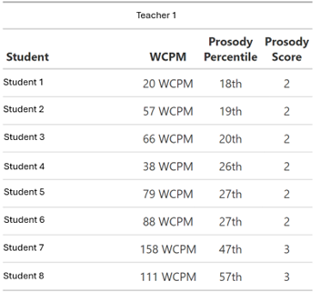

# Introduction

Oral reading fluency (ORF), generally defined as reading quickly, accurately, and with prosody (i.e., the expressiveness with which students read), is an essential part of reading proficiency. As perhaps the most prevalent reading assessment used in classrooms across the country, words read correctly per minute (WCPM) measures of ORF are robust indicators of comprehension and overall reading achievement; however, traditional ORF assessments do not align with the theoretical definition of fluency, measuring only accuracy and rate and neglecting the measurement of prosody. Educators recognize that fluent reading extends beyond speed and correctness and involves prosody; or, expression, rhythm, stress, and intonation. Prosody reflects not only decoding but also the extent to which readers construct meaning from text. Research has shown that measures of prosody explain variance in reading comprehension beyond measures of rate and accuracy, and that students with good prosody have better comprehension than might be expressed based on their ORF scores alone [@benjamin2010; @miller2006, @miller2008; @valencia2010]. 
This study is part of a larger project—CORE + Prosody—aimed to respond to the call “to expand the way fluency is measured so that it encompasses more than rate and accuracy” [@kuhn2010, p. 243]. The purpose of CORE + Prosody was to develop and validate an automated scoring system to measure, unite, and scale the rate, accuracy, and prosody in ORF to be used as a screening and progress monitoring measure for students in Grades 2 through 4. The purpose of this study is to examine the feasibility of use of the project’s ORF estimates. 

The CORE + Prosody assessment is very similar to ORF assessments that most students take three times per year, except we have developed a score for prosody, which is a novel score of which teachers do not typically have access. The goal of this study was to understand teachers’ perceptions and experiences with prosody, and how whether a meausure of prosody might contribute instructional information beyond WCPM. To meet this goal, we administered two surveys (closed- and open-ended responses) to teachers whose students were given the CORE + Prosody assessment to understand those teachers' perceptions of prosody, and how it might be used in their classroom.

The *initial* survey captured baseline awareness, beliefs, and practices related to evaluating and teaching prosody, while the *follow-up* survey gave teachers an opportunity to review their students’ prosody scores; a four-point nominal prosody score based on the 2005 NAEP scale [@daane2005], and a continuous percentile scale. Comparing responses across the two time points allowed the exploration of (a) whether teachers’ perceptions of or willingness and capacity to use prosody changed after reviewing their students’ prosody scores, and (b) how teachers evaluate the potential usefulness and accuracy of prosody for informing instruction. We also examined grade-level patterns to understand whether perceptions differed across developmental stages in reading instruction. 

# Method

## Procedures & Measure

In the 2023-24 school year, we administered six CORE passages to 373 students across Grades 2-4 from 4 schools and 27 classrooms (8 Grade 2, 12 Grade 3, and 7 Grade 4). Students were assessed online, using classroom or school devices. The audio files were scored by an automated speech recognition engine for both model-based WCPM [@coresite; @kara2020; @nese2022; @nese2021sem; @nese2021asr; @potgieter2017] and prosody [@coreprosody; @sammit2022; @wang2023; @wang2024; @wang2025]. Classroom teachers did not administer or score the fluency assessments; instead, they reviewed prosody and WCPM outcomes generated automatically by they project.

Following the student participation, participating classroom teachers were invited to complete two online surveys, as the focus was on teachers’ perceptions of prosody and its feasibility of use rather than student outcomes. The purpose of the *initial* survey was to understand teachers’ perceptions of oral reading fluency assessments and prosody, and how they are used in their classroom. The *initial* survey asked about perceptions of ORF assessment and prosody, including the latter's usefulness for instruction, current classroom practices, and whether teachers might use prosody to guide teaching (see Initial Survey below). The *follow-up* survey provided teachers with their students’ oral reading fluency and prosody scores from the study with the purpose of understanding if and how those are helpful to their teaching and students. The *follow-up* survey was guided by teachers’ direct exposure to student prosody scores, including preferred reporting score format (nominal scale vs. continuous percentile), perceived accuracy of prosody and WCPM measures, and ways prosody could inform instruction (see Follow-Up Survey below). Both surveys included closed- and open-ended questions and prompts. 

## Sample

```{r}
#| message: false
library(tidyverse)
library(scales)
library(ellmer)
library(knitr)
library(kableExtra)
library(readxl)
library(here)
library(gt)

```


```{r}
#| message: false

dta_final <- read_rds(here::here("nopublish", "data", "dta_final.rds"))


########## Reading the Pre Prosody codebook and data ##########

pre_data <- dta_final$data[[1]]

########## Reading the Post Prosody codebook and data ##########

post_data <- dta_final$data[[2]]


```


A total of 27 teachers in Grades 2 through 4 completed the *initial* survey and 21 completed the *follow-up* survey across Grades 2–4. Please see @tbl-demo.  

```{r}
#| label: tbl-demo
#| tbl-cap: "Survey Respondents"

left_join(
pre_data |> 
  group_by(grade) |> 
  summarize(Initial = n()),
post_data|> 
  group_by(grade) |> 
  summarize("Follow-up" = n())
) |> 
  mutate(grade = paste("Grade", grade)) |> 
  rename(Grade = grade) |> 
  janitor::adorn_totals() |> 
  kable(col.names = c("", "Initial", "Follow-up"))
```

## Data Analysis

Closed-ended survey responses were analyzed descriptively using frequencies and percentages to examine patterns in teachers’ responses.  

Open-ended responses were analyzed in two steps. First, thematic clustering was conducted using the `{ellmer}` package [@ellmer] to generate themes based on the content of teacher responses. During the qualitative analysis process, AI-assisted theme identification was conducted using **Google Gemini** Gemini 2.5 Flash through the `chat_google_gemini()` function in `R`. For both the initial and follow-up-survey responses, the same structured prompt was used. The prompt instructed the AI system to analyze teachers’ responses to all nine of the open-ended questions across both surveys.The following prompt was given to the AI engine: *identify five key themes, provide a brief definition for each theme, report the number of responses supporting each theme.* The resulting AI-generated themes and definitions were then used as the thematic framework for subsequent coding and analysis. The AI-generated themes were established prior to coding and were not regenerated during later stages of analysis.


Second, responses were coded by two humans and AI for alignment with the generated themes using a binary response–theme framework. That is, raters identified whether a teacher's responses was aligned with each of the five themes. The result was a response-by-theme matrix (*aligned* vs. *not aligned*). An additional column was included for each set of themes across the nine variables to present the mean percent alignment among raters. For each theme, the percentage endorsement was first calculated separately for each rater and then averaged across the available raters (two or three, depending on the variable). Human raters were blind to the AI classifications. Human raters independently reviewed six of the nine open-ended questions, with each rater reviewing three of the same questions and three different questions. Thus, all nine questions were reviewed by at least two raters: three questions were reviewed by human 1 and AI, three questions were reviewed by human 2 and AI, and three questions were reviewed by all three raters. Human 1 was research faculty with a PhD in School Psychology and over 16 years experience. Human 2 was a graduate student with multiple years of experience in academia and research. Separately, inter-rater agreement was calculated as the percentage of exact agreement for each open-ended question. For each question, agreement percentages were computed as the proportion of response–theme combinations for which raters assigned the same coding decision (*aligned* or *not aligned*). Mean endorsement percentages across raters were used to describe variability in endorsement.


All analyses and data visualizations were conducted and created in the `R` programming environment [@R] with the following `R` packages: `ellmer` [@ellmer], `gt` [@gt], `here` [@here], `janitor` [@janitor] `knitr` [@knitr], `kableExtra` [@kableExtra], `readxl` [@readxl], `scales` [@scales], and `tidyverse` [@tidyverse] .


# Results

We first report the inter-rater reliability for the scoring of the open-ended survey questions, then describe the results of both surveys.

```{r}
#| message: false
######## Loading the Datasets  #########


load_arrange_data <- function(path, sheet, rater_name) {
                              read_excel(path, sheet = sheet) %>%
                              slice(-1) %>%
                              select(-any_of("NA")) %>%
                              mutate(response_id = as.character(response_id)) %>%
                              pivot_longer(
                                            cols = -response_id,
                                            names_to  = "theme",
                                            values_to = rater_name )%>%  
                              mutate(!!rater_name := as.numeric(.data[[rater_name]]))
}


# Loading the AI data is slightly different as it does not contain any definition and do not need the slice


load_arrange_data_ai <- function(path, sheet, rater_name) {
                              read_excel(path, sheet = sheet) %>%
                              select(-any_of("NA")) %>%
                              mutate(response_id = as.character(response_id)) %>%
                              pivot_longer(
                                            cols = -response_id,
                                            names_to  = "theme",
                                            values_to = rater_name )%>%  
                              mutate(!!rater_name := as.numeric(.data[[rater_name]]))
                                                     }


########## Joining Data Sets  #############

join_raters <- function(...) {
                  raters <- list(...)
                  reduce( 
                     raters,
                     inner_join,
                     by = c("response_id", "theme") )
                             }


########## Variable-level endorsement summary #############

summary_3raters <- function(data, variable_name) {
                    data %>%
                    summarise(
                        Nafisul_pct = mean(Nafisul == 1, na.rm = TRUE) * 100,
                        Joe_pct     = mean(Joe == 1, na.rm = TRUE) * 100,
                        AI_pct      = mean(AI == 1, na.rm = TRUE) * 100  ) %>%
                    
                    mutate(
                       Variable = variable_name,
                       Mean_pct = (Nafisul_pct + Joe_pct + AI_pct) / 3,
                       Min_pct  = pmin(Nafisul_pct, Joe_pct, AI_pct),
                       Max_pct  = pmax(Nafisul_pct, Joe_pct, AI_pct)) %>%
    
                    select(Variable, Nafisul_pct, Joe_pct, AI_pct, Mean_pct, Min_pct, Max_pct)
                    
                    }


summary_2raters <- function(data, variable_name, human_rater = c("Nafisul", "Joe")) {
                    
                    human_rater <- match.arg(human_rater)
                                   if (human_rater == "Nafisul") {
                                   data %>%
                                      summarise(
                                        Human_pct = mean(Nafisul == 1, na.rm = TRUE) * 100, 
                                        AI_pct    = mean(AI == 1, na.rm = TRUE) * 100 ) %>%
                                   mutate(
                                        Variable = variable_name,
                                        Mean_pct = (Human_pct + AI_pct) / 2,
                                        Min_pct  = pmin(Human_pct, AI_pct),
                                        Max_pct  = pmax(Human_pct, AI_pct) ) %>%
                                  select(Variable, Human_pct, AI_pct, Mean_pct, Min_pct, Max_pct) } 
                                  else {
                                  data %>%
                                      summarise(
                                      Human_pct = mean(Joe == 1, na.rm = TRUE) * 100,
                                      AI_pct    = mean(AI == 1, na.rm = TRUE) * 100) %>%
                                mutate(
                                     Variable = variable_name,
                                     Mean_pct = (Human_pct + AI_pct) / 2,
                                     Min_pct  = pmin(Human_pct, AI_pct),
                                     Max_pct  = pmax(Human_pct, AI_pct)  ) %>%
                                select(Variable, Human_pct, AI_pct, Mean_pct, Min_pct, Max_pct)
                                      }
}


agreement_3raters <- function(data, variable_name) {
  data %>%
    summarise(
      N = n(),
      `Human 1 – Human 2` = mean(Joe == Nafisul, na.rm = TRUE) * 100,
      `Human 1 – AI`      = mean(Joe == AI, na.rm = TRUE) * 100,
      `Human 2 – AI`      = mean(Nafisul == AI, na.rm = TRUE) * 100,
      `All Three`         = mean((Joe == Nafisul) & (Nafisul == AI), na.rm = TRUE) * 100
    ) %>%
    mutate(Variable = variable_name) %>%
    select(Variable, N, `Human 1 – Human 2`, `Human 1 – AI`, `Human 2 – AI`, `All Three`)
}


agreement_2raters <- function(data, variable_name, human_rater = c("Nafisul", "Joe")) {
  
  human_rater <- match.arg(human_rater)
  
  if (human_rater == "Nafisul") {
    data %>%
      summarise(
        N = n(),
        `Human 1 – Human 2` = NA_real_,
        `Human 1 – AI`      = NA_real_,
        `Human 2 – AI`      = mean(Nafisul == AI, na.rm = TRUE) * 100,
        `All Three`         = NA_real_
      ) %>%
      mutate(Variable = variable_name) %>%
      select(Variable, N, `Human 1 – Human 2`, `Human 1 – AI`, `Human 2 – AI`, `All Three`)
    
  } else {
    data %>%
      summarise(
        N = n(),
        `Human 1 – Human 2` = NA_real_,
        `Human 1 – AI`      = mean(Joe == AI, na.rm = TRUE) * 100,
        `Human 2 – AI`      = NA_real_,
        `All Three`         = NA_real_
      ) %>%
      mutate(Variable = variable_name) %>%
      select(Variable, N, `Human 1 – Human 2`, `Human 1 – AI`, `Human 2 – AI`, `All Three`)
  }
}


```


```{r}


make_theme_table <- function(path, sheet) {
  
  read_excel(
    path,
    sheet = sheet,
    col_names = FALSE
  ) %>%
    dplyr::slice(1:2) %>%
    pivot_longer(
      cols = -1,
      names_to = "col",
      values_to = "value"
    ) %>%
    pivot_wider(
      names_from = ...1,
      values_from = value
    ) %>%
    select(-col) %>%
    rename(Theme = response_id)
}


theme_agreement_table1 <- function(theme_table, compare_data) {
  
  raters <- intersect(
    c("Nafisul", "Joe", "AI"),
    names(compare_data)
  )
  
  agreenment <- compare_data %>%
    pivot_longer(
      cols = all_of(raters),
      names_to = "Rater",
      values_to = "value"
    ) %>%
    mutate(value = as.numeric(value)) %>%
    group_by(theme, Rater) %>%
    summarize(
      pct = sum(value, na.rm = TRUE) / n(),
      .groups = "drop"
    ) %>%
    group_by(theme) %>%
    summarize(
      `Mean % Agreenment` = paste0(round(mean(pct, na.rm = TRUE) * 100), "%"),
      .groups = "drop"
    ) %>%
    rename(Theme = theme)
  
  removed_themes <- theme_table %>%
    left_join(agreenment, by = "Theme") %>%
    filter(
      is.na(`Mean % Agreenment`) |
        `Mean % Agreenment` == 0
    ) %>%
    pull(Theme)
  
  final_table <- theme_table %>%
    left_join(agreenment, by = "Theme") %>%
    filter(`Mean % Agreenment` > 0) %>%
    arrange(desc(`Mean % Agreenment`))
  
  list(
    table = final_table,
    removed_themes = removed_themes
  )
}


```


```{r}
#| message: false
## Loading datasets


orfuseful_how_nh <- load_arrange_data(
                    path = here::here("nopublish", "data", "Pre survey workbook_nafisul.xlsx"),
                   sheet = 2,
                   rater_name = "Nafisul" )


orfuseful_how_jftn <- load_arrange_data(
                      path = here::here("nopublish", "data", "Pre survey workbook_jftn.xlsx"),
                      sheet = 2,
                      rater_name = "Joe" )


orfuseful_how_ai <- load_arrange_data_ai(
                    path = here::here("nopublish", "data", "orfuseful_how_coding_workbook.xlsx"),
                    sheet = 2,
                    rater_name = "AI" )

orfuseful_how_compare <- join_raters(
                         orfuseful_how_nh,
                         orfuseful_how_jftn,
                         orfuseful_how_ai )


might_nh <- load_arrange_data(
                    path = here::here("nopublish", "data", "Pre survey workbook_nafisul.xlsx"),
                   sheet = 7,
                   rater_name = "Nafisul" )


might_jftn <- load_arrange_data(
                      path = here::here("nopublish", "data", "Pre survey workbook_jftn.xlsx"),
                      sheet = 7,
                      rater_name = "Joe" )


might_ai <- load_arrange_data_ai(
                    path = here::here("nopublish", "data", "might_coding_workbook.xlsx"),
                    sheet = 2,
                    rater_name = "AI" )

might_compare <- join_raters(
                            might_nh,
                            might_jftn,
                            might_ai )


evaluate_nh <- load_arrange_data(
                    path = here::here("nopublish", "data", "Pre survey workbook_nafisul.xlsx"),
                   sheet = 3,
                   rater_name = "Nafisul" )


evaluate_ai <- load_arrange_data_ai(
                    path = here::here("nopublish", "data", "evaluate_how_coding_workbook.xlsx"),
                    sheet = 2,
                    rater_name = "AI" )

evaluate_compare <- join_raters(
                            evaluate_nh,
                            evaluate_ai )


inform_nh <- load_arrange_data(
                    path = here::here("nopublish", "data", "Pre survey workbook_nafisul.xlsx"),
                   sheet = 4,
                   rater_name = "Nafisul" )


inform_ai <- load_arrange_data_ai(
                    path = here::here("nopublish", "data", "inform_how_coding_workbook.xlsx"),
                    sheet = 2,
                    rater_name = "AI" )

inform_compare <- join_raters(
                            inform_nh,
                            inform_ai )


teach_how_jftn <- load_arrange_data(
                      path = here::here("nopublish", "data", "Pre survey workbook_jftn.xlsx"),
                      sheet = 5,
                      rater_name = "Joe" )


teach_ai <- load_arrange_data_ai(
                    path = here::here("nopublish", "data", "teach_how_coding_workbook.xlsx"),
                    sheet = 2,
                    rater_name = "AI" )

teach_compare <- join_raters(
                            teach_how_jftn,
                            teach_ai )


influence_jftn <- load_arrange_data(
                      path = here::here("nopublish", "data", "Pre survey workbook_jftn.xlsx"),
                      sheet = 6,
                      rater_name = "Joe" )


	
influence_ai <- load_arrange_data_ai(
                    path = here::here("nopublish", "data", "influence_how_coding_workbook.xlsx"),
                    sheet = 2,
                    rater_name = "AI" )

	
influence_compare <- join_raters(
                            	influence_jftn,
                            	influence_ai )


orf_summary <- agreement_3raters(
                  data = orfuseful_how_compare,
                  variable_name = "How do ORF scores influence\n your teaching?" )

might_summary <- agreement_3raters(
                    data = might_compare,
                    variable_name = "How might prosody scores influence\n your teaching?")

evaluate_summary <- agreement_2raters(
                    data = evaluate_compare,
                    variable_name = "How do you evaluate prosody\n in your classroom?",
                    human_rater = "Nafisul")

inform_summary <- agreement_2raters(
                  data = inform_compare,
                  variable_name = "How do you use prosody to\n inform your teacher?",
                  human_rater = "Nafisul")

teach_summary <- agreement_2raters(
                 data = teach_compare,
                 variable_name = "How do you teach prosody in your\n reading instruction?",
                 human_rater = "Joe")

influence_summary <- agreement_2raters(
                     data = influence_compare,
                     variable_name = "How does a student’s prosody influence\n the reading supports you provide?",
                     human_rater = "Joe")


all_variable_results <- bind_rows(
                        orf_summary,
                        might_summary,
                        evaluate_summary,
                        inform_summary,
                        teach_summary,
                        influence_summary )


```


```{r}
#| message: false

# loading post data

# Nafusil: All of this can be refactored so there is not so much copy/paste, but we can save that to the end at this point.

use_nh <- load_arrange_data(
                    path = here::here("nopublish", "data", "Post survey workbook_nafisul.xlsx"),
                   sheet = 4,
                   rater_name = "Nafisul" )


use_jftn <- load_arrange_data(
                      path = here::here("nopublish", "data", "Post survey workbook_jftn.xlsx"),
                      sheet = 4,
                      rater_name = "Joe" )


use_ai <- load_arrange_data_ai(
                    path = here::here("nopublish", "data", "use_coding_workbook.xlsx"),
                    sheet = 2,
                    rater_name = "AI" )

use_compare <- join_raters(
                         use_nh,
                         use_jftn,
                         use_ai )


newinfo_what_nh <- load_arrange_data(
                    path = here::here("nopublish", "data", "Post survey workbook_nafisul.xlsx"),
                   sheet = 3,
                   rater_name = "Nafisul" )


newinfo_what_ai <- load_arrange_data_ai(
                    path = here::here("nopublish", "data", "newinfo_what_coding_workbook.xlsx"),
                    sheet = 2,
                    rater_name = "AI" )

newinfo_what_compare <- join_raters(
                         newinfo_what_nh,
                         newinfo_what_ai )


q57_jftn <- load_arrange_data(
                      path = here::here("nopublish", "data", "Post survey workbook_jftn.xlsx"),
                      sheet = 2,
                      rater_name = "Joe" )


q57_ai <- load_arrange_data_ai(
                    path = here::here("nopublish", "data", "Why do you prefer that prosody measure_coding_workbook.xlsx"),
                    sheet = 2,
                    rater_name = "AI" )

q57_compare <- join_raters(
                         q57_jftn,
                         q57_ai )


# Summary Table

use_summary <- agreement_3raters(
                  data = use_compare,
                  variable_name = "How might you use these prosody \nmeasures to inform your teaching?" )


newinfo_what_summary <- agreement_2raters(
                    data = newinfo_what_compare,
                    variable_name = "What additional or new information \ndid the prosody measures provide for \nyou about your students’ reading?",
                    human_rater = "Nafisul")


q57_summary <- agreement_2raters(
                 data = q57_compare,
                 variable_name = "Why do you prefer that prosody measure (q57)?",
                 human_rater = "Joe")


all_variable_results <- bind_rows(
                        use_summary,
                        newinfo_what_summary,
                        q57_summary )


```

```{r}
#| message: false
# Creating summary table(pre + post)

final_table <- bind_rows(

  agreement_3raters(orfuseful_how_compare, "How do oral reading fluency scores influence your teaching, either for the whole classroom or individual students?"),
  agreement_3raters(might_compare, "How might prosody scores influence your teaching?"),

  agreement_2raters(evaluate_compare, "How do you evaluate prosody in your classroom? ", "Nafisul"),
  agreement_2raters(inform_compare, "How do you use prosody to inform your teacher?", "Nafisul"),
  agreement_2raters(teach_compare, "How do you teach prosody in your reading instruction?", "Joe"),
  agreement_2raters(influence_compare, "How does a student’s prosody influence the reading supports you provide?", "Joe"),

  agreement_3raters(use_compare, "How might you use these prosody measures to inform your teaching?"),
  agreement_2raters(newinfo_what_compare, "Do the prosody measures provide additional or new information for you about your students’ reading?", "Nafisul"),
  agreement_2raters(q57_compare, "Why do you prefer that prosody measure?", "Joe")

                  )


# table for overall agreement


overall <- bind_rows(
            orfuseful_how_compare,
            might_compare,
            evaluate_compare,
            inform_compare,
            teach_compare,
            influence_compare,
            use_compare,
            newinfo_what_compare,
            q57_compare) %>%
          summarise(
              Variable = "Overall Agreement",
              N = n(),
              `Human 1 – Human 2` = mean(Joe == Nafisul, na.rm = TRUE) * 100,
              `Human 1 – AI`      = mean(Joe == AI, na.rm = TRUE) * 100,
              `Human 2 – AI`      = mean(Nafisul == AI, na.rm = TRUE) * 100,
              `All Three`         = mean((Joe == Nafisul) & (Nafisul == AI), na.rm = TRUE) * 100 )


######### Human 1 = Joe, Human 2 = Nafisul #########

# Join two tables

final_table <- bind_rows(final_table, overall)
```

## Inter-Rater Agreement

Inter-rater agreement was examined across the coded response–theme pairs for open-ended items of both the initial and follow-up surveys (Table 2). Because some items were coded jointly by two human raters and AI, while others were coded by one human rater and AI, not all agreement comparisons were available for every variable.

Agreement levels were generally high across raters and questions. The three items coded by all three raters showed pairwise agreement ranging from `r sprintf("%.1f", min(final_table[c(1:2, 7), 3:5]))`% to `r sprintf("%.1f", max(final_table[c(1:2, 7), 3:5]))`%, and agreement across all three raters from `r round(min(final_table[c(1:2, 7), 6, drop = TRUE]), 1)`% to `r round(max(final_table[c(1:2, 7), 6, drop = TRUE]), 1)`%. Among the six items coded by one human rater and AI, agreement was ranged from `r round(min(final_table[c(3:6,8:9), 4:5], na.rm = TRUE), 1)`% to `r round(max(final_table[c(3:6,8:9), 4:5], na.rm = TRUE), 1)`%.

Across all coded response–theme pairs (*N* = 1,125), overall pairwise agreement between Human 1 and Human 2 was `r round(final_table[10, 3, drop = TRUE], 1)`%, between Human 1 and AI was `r round(final_table[10, 4, drop = TRUE], 1)`% between, and between Human 2 and AI was `r round(final_table[10, 5, drop = TRUE], 1)`%. Overall agreement across all three raters was `r round(final_table[10, 6, drop = TRUE], 1)`%. In general, the agreement values indicate generally consistent theme classification across raters and support the reliability of the coding procedures used for the open-ended responses.


```{r, message=FALSE, warning=FALSE, echo=FALSE}


final_table %>%
      mutate(
        Survey = c(
        rep("Initial Survey", 6),
        rep("Follow-up Survey", 3),
        "Overall") ) %>%
      gt(groupname_col = "Survey") %>%
      fmt_number(
      columns = c(`Human 1 – Human 2`,
                `Human 1 – AI`,
                `Human 2 – AI`,
                `All Three`),
      decimals = 1 ) %>%
            sub_missing(
            columns = everything(),
            missing_text = "–" ) %>%
            cols_label(
            Variable = "Open-ended Question", 
            N = "Coded Pairs",
            `Human 1 – Human 2` = "Human1–Human2 (%)",
            `Human 1 – AI` = "Human1–AI (%)",
            `Human 2 – AI` = "Human2–AI (%)",
            `All Three` = "All Three (%)" ) %>%
      tab_header(
      title = md("**Inter-Rater Agreement**"),
      subtitle = "Percent agreement across coded response-theme pairs" ) %>%
      tab_options(
          table.font.size = px(12),
          data_row.padding = px(6))


```

## Initial Survey

### Usefullness of ORF Scores

All teachers across Grades 2–4 reported that ORF scores were useful for their teaching, with 100% affirmative responses at each grade level.

```{r}
#| message: false
oral_read_flu_summary <- pre_data %>%
                             filter(!is.na(orfuseful)) %>%
                             group_by(grade, orfuseful) %>%
                             summarise(count = n(), .groups = "drop") %>%
                             group_by(grade) %>%
                             mutate(
                                     percentage = count / sum(count), 
                                     label_text = paste0(round(percentage * 100), "%\n(n=", count, ")")) %>%
                             ungroup()

# Nafisul: For all of the ggplot functions that are used in each plot, just save it as a function

oral_read_flu_summary |> 
  mutate(grade = paste("Grade", grade)) |> 
ggplot(
        aes( x    = factor(grade), 
             y    = percentage, 
             fill = orfuseful)) +
        
        geom_col(width = 0.6, color = "white") +


        geom_text(
                   aes(label = label_text),
                   position = position_stack(vjust = 0.5),
                   color = "black",
                   size = 4.2,
                   fontface = "bold"
                   ) +

        scale_fill_manual(values = c(
                                      "Yes"   = "#4CAF50", 
                                      "Maybe" = "#FFC107", 
                                      "No"    = "#F44336" 
                                     )) +

        scale_y_continuous ( labels = percent_format(accuracy = 1), 
                              limits = c(0, 1.1)) +

        labs(
                 title     = "Are ORF scores useful for your teaching?",
                 x         = NULL,
                 y         = "Percentage of Teachers",
                 fill      = NULL
              ) +

        theme_minimal() +
         theme(
                plot.title          = element_text(face = "bold", hjust = 0.5, size = 13),
                plot.title.position = "plot",
                plot.subtitle       = element_text(hjust = 0.5, color = "black", size = 11),
                legend.position     = "top",
                legend.title.       = element_text(face = "bold"),
                panel.grid.major.x  = element_blank(),
                panel.grid.minor    = element_blank(),
                axis.title.x.       = element_text(face = "bold"),
                axis.title.y        = element_text(face = "bold")
                 )


```

When describing how ORF scores influenced their teaching, teachers most commonly referenced using ORF data to support instructional decision-making. Their responses highlighted the use of ORF scores for flexible grouping and differentiated instruction, identifying students needing intervention or additional support, informing instructional planning and resource selection, and monitoring student progress over time. Overall, teachers described ORF scores as useful for identifying students’ reading needs and guiding both whole-class and individual instructional decisions.

<style>
caption {
  caption-side: top;
  font-weight: bold;
  font-size: 16px;     
  color: black; 
}
</style>

```{r}

theme_table <- make_theme_table(
               path = here::here("nopublish", "data", "Pre survey workbook_nafisul.xlsx"),
               sheet = 2)


use_theme_result <- theme_agreement_table1(
                      theme_table,
                      orfuseful_how_compare )


use_theme_result$table %>%
          kbl(align = c("l", "l", "c"),
              booktabs = TRUE,
              col.names = c( "Theme", "Definition", "Mean % Agreement" ),
              caption = "How do ORF scores influence your teaching?<br>Themes, Definitions, and Mean Agreement" ) %>%
              kable_styling( 
                      position = "center",
                      font_size = 10,
                      full_width = FALSE ) %>%
              row_spec(
                      0,
                      bold = TRUE,
                      background = "darkolivegreen4",
                      color = "black" ) %>%
              column_spec(
                      1,
                      background = "darkolivegreen3",
                      color = "black",
                      bold = TRUE,
                      width = "15em" ) %>%
              column_spec(
                      2,
                      background = "khaki1",
                      width = "22em" ) %>%
              column_spec(
                      3,
                      background = "khaki1",
                      width = "12em" )


```


### Teaching Prosody

Most teachers reported teaching prosody in their reading instruction, although responses varied somewhat across grade levels. A majority of teachers in Grade 2 (50%), Grade 3 (83%), and Grade 4 (57%) indicated that they taught prosody, while relatively few teachers reported not teaching it. Some uncertainty was reflected among Grade 2 and Grade 4 teachers, where 38% and 29% selected *Maybe*, respectively.

```{r}

teach_summary <- pre_data %>%
                             filter(!is.na(teach)) %>%
                             group_by(grade, teach) %>%
                             summarise(count = n(), .groups = "drop") %>%
                             group_by(grade) %>%
                             mutate(
                                     percentage = count / sum(count), 
                                     label_text = paste0(round(percentage * 100), "%\n(n=", count, ")")) %>%
                             ungroup()


teach_summary |> 
  mutate(grade = paste("Grade", grade)) |> 
ggplot( 
        aes( x    = fct_rev(grade), 
             y    = percentage, 
             fill = teach)) +
        
        geom_col(width = 0.6, color = "white") +


        geom_text(
                   aes(label = label_text),
                   position = position_stack(vjust = 0.5),
                   color = "black",
                   size = 4.2,
                   fontface = "bold"
                   ) +

        scale_fill_manual(values = c(
                                      "Yes"   = "#4CAF50", 
                                      "Maybe" = "#FFC107", 
                                      "No"    = "#F44336" 
                                     ))+


        scale_y_continuous ( labels = percent_format(accuracy = 1), 
                              limits = c(0, 1.1)) +

        labs(
                 title  = "In your reading instruction, do you teach prosody?",
                 x         = NULL,
                 y         = "Percentage of Teachers",
                 fill      = NULL
              ) +

        theme_minimal() +
         theme(
                plot.title          = element_text(face = "bold", hjust = 0.5, size = 13),
                plot.title.position = "plot",
                plot.subtitle       = element_text(hjust = 0.5, color = "black", size = 11),
                legend.position     = "top",
                legend.title.       = element_text(face = "bold"),
                panel.grid.major.x  = element_blank(),
                panel.grid.minor    = element_blank(),
                axis.title.x.       = element_text(face = "bold"),
                axis.title.y        = element_text(face = "bold")
                 ) +
  guides(fill = guide_legend(reverse = TRUE)) +
  coord_flip()


```

<style>
caption {
  caption-side: top;
  font-weight: bold;
  font-size: 16px;     
  color: black; 
}
</style>

Among teachers who reported teaching prosody, their responses most commonly described modeling expressive reading and explicitly teaching prosodic elements such as intonation, pacing, rhythm, and punctuation. Teachers also described using practice-based activities, including partner and choral reading, integrating prosody into broader reading instruction and different text types, and differentiating prosody instruction based on students’ reading levels and fluency needs.


```{r}


theme_table <- make_theme_table(
               path = here::here("nopublish", "data", "Pre survey workbook_nafisul.xlsx"),
               sheet = 5)


use_theme_result <- theme_agreement_table1(
                      theme_table,
                      teach_compare )


use_theme_result$table %>%
          kbl(align = c("l", "l", "c"),
              booktabs = TRUE,
              col.names = c( "Theme", "Definition", "Mean % Alignment" ),
              caption = "How do you teach prosody in your reading instruction?<br>Themes, Definitions, and Mean Percent Alignment" ) %>%
              kable_styling( 
                      position = "center",
                      font_size = 10,
                      full_width = FALSE ) %>%
              row_spec(
                      0,
                      bold = TRUE,
                      background = "darkolivegreen4",
                      color = "black" ) %>%
              column_spec(
                      1,
                      background = "darkolivegreen3",
                      color = "black",
                      bold = TRUE,
                      width = "15em" ) %>%
              column_spec(
                      2,
                      background = "khaki1",
                      width = "22em" ) %>%
              column_spec(
                      3,
                      background = "khaki1",
                      width = "12em" )


```

### Evaluating Prosody

Teachers were asked whether they evaluated prosody in their classrooms. Across grade levels, approximately half or more of teachers reported evaluating prosody, including 62% of Grade 2 teachers, 50% of Grade 3 teachers, and 57% of Grade 4 teachers. Responses also reflected some uncertainty in practice, particularly among Grade 3 teachers, where 33% responded *Maybe*. Smaller proportions of teachers reported not evaluating prosody, including 17% of Grade 3 teachers and 29% of Grade 4 teachers.

```{r}

evaluate_summary <- pre_data %>%
                             filter(!is.na(evaluate)) %>%
                             group_by(grade, evaluate) %>%
                             summarise(count = n(), .groups = "drop") %>%
                             group_by(grade) %>%
                             mutate(
                                     percentage = count / sum(count), 
                                     label_text = paste0(round(percentage * 100), "%\n(n=", count, ")")) %>%
                             ungroup()


evaluate_summary |> 
  mutate(grade = paste("Grade", grade)) |> 
ggplot(
        aes( x    = fct_rev(grade), 
             y    = percentage, 
             fill = evaluate)) +
        
        geom_col(width = 0.6, color = "white") +


        geom_text(
                   aes(label = label_text),
                   position = position_stack(vjust = 0.5),
                   color = "black",
                   size = 4.2,
                   fontface = "bold"
                   ) +

        scale_fill_manual(values = c(
                                      "No"    = "#F44336",
                                      "Maybe" = "#FFC107",
                                      "Yes"   = "#4CAF50" 
                                     )) +

        scale_y_continuous ( labels = percent_format(accuracy = 1), 
                              limits = c(0, 1.1)) +

        labs(
                 title     = "Do you evaluate prosody in your classroom?",
                 x         = NULL,
                 y         = "Percentage of Teachers",
                 fill      = NULL,
              ) +

        theme_minimal() +
         theme(
                plot.title          = element_text(face = "bold", hjust = 0.5, size = 13),
                plot.title.position = "plot",
                plot.subtitle       = element_text(hjust = 0.5, color = "black", size = 11),
                legend.position     = "top",
                legend.title.       = element_text(face = "bold"),
                panel.grid.major.x  = element_blank(),
                panel.grid.minor    = element_blank(),
                axis.title.x.       = element_text(face = "bold"),
                axis.title.y        = element_text(face = "bold")
                 ) +
  guides(fill = guide_legend(reverse = TRUE)) +
  coord_flip()


```

Among teachers who reported evaluating prosody, their responses most commonly described using informal classroom observations, anecdotal notes, and existing ORF assessments to evaluate students’ expressive reading. Teachers also described evaluating prosody during instructional activities through modeling expressive reading and observing students’ comprehension and meaning-making. Some responses additionally referenced using prosody-related information for reporting or broader assessment purposes.

<style>
caption {
  caption-side: top;
  font-weight: bold;
  font-size: 16px;     
  color: black; 
}
</style>


```{r}


theme_table <- make_theme_table(
               path = here::here("nopublish", "data", "Pre survey workbook_nafisul.xlsx"),
               sheet = 3)


use_theme_result <- theme_agreement_table1(
                      theme_table,
                      evaluate_compare )


use_theme_result$table %>%
          kbl(align = c("l", "l", "c"),
              booktabs = TRUE,
              col.names = c( "Theme", "Definition", "Mean % Alignment" ),
              caption = "How do you evaluate prosody in your classroom?<br>Themes, Definitions, and Mean Percent Alignment" ) %>%
              kable_styling( 
                      position = "center",
                      font_size = 10,
                      full_width = FALSE ) %>%
              row_spec(
                      0,
                      bold = TRUE,
                      background = "darkolivegreen4",
                      color = "black" ) %>%
              column_spec(
                      1,
                      background = "darkolivegreen3",
                      color = "black",
                      bold = TRUE,
                      width = "15em" ) %>%
              column_spec(
                      2,
                      background = "khaki1",
                      width = "22em" ) %>%
              column_spec(
                      3,
                      background = "khaki1",
                      width = "12em" )


```


### Influence of Prosody

Teachers reported mixed perspectives regarding whether students’ prosody influenced the reading supports they provided. Grade 3 teachers most frequently indicated that prosody influenced instructional supports (67%), whereas responses were more divided among Grade 2 and Grade 4 teachers. In Grade 4, 43% of teachers reported that prosody did not influence the supports they provided, while 29% selected *Maybe*. Similarly, Grade 2 teachers were evenly split between *Yes* (38%) and *Maybe* (38%), with 25% responding *No*.


```{r}

influence_summary <- pre_data %>%
                             filter(!is.na(influence)) %>%
                             group_by(grade, influence) %>%
                             summarise(count = n(), .groups = "drop") %>%
                             group_by(grade) %>%
                             mutate(
                                     percentage = count / sum(count), 
                                     label_text = paste0(round(percentage * 100), "%\n(n=", count, ")")) %>%
                             ungroup()

# Nafisul: the order of the categories Yes, No, Maybe are out of order in this plot (DONE)
influence_summary |> 
  mutate(grade = paste("Grade", grade)) |> 
ggplot( 
        aes( x    = fct_rev(grade), 
             y    = percentage, 
             fill = factor(influence, levels = c("No", "Maybe", "Yes")))) +
        
        geom_col(width = 0.6, color = "white", position = position_stack(reverse = TRUE)) +


        geom_text(
                   aes(label = label_text),
                   #position = position_stack(vjust = 0.5),
                   position = position_stack(reverse = TRUE, vjust = 0.5),
                   color = "black",
                   size = 4.2,
                   fontface = "bold"
                   ) +

        scale_fill_manual(values = c(
                                      "Yes"   = "#4CAF50", 
                                      "Maybe" = "#FFC107", 
                                      "No"    = "#F44336" 
                                     )) +

        scale_y_continuous ( labels = percent_format(accuracy = 1), 
                              limits = c(0, 1.1)) +

        labs(
                 title  = "Does a student’s prosod\ninfluence the reading supports you provide?",
                 x         = NULL,
                 y         = "Percentage of Teachers",
                 fill      = NULL
              ) +

        theme_minimal() +
         theme(
                plot.title          = element_text(face = "bold", hjust = 0.5, size = 13),
                plot.title.position = "plot",
                plot.subtitle       = element_text(hjust = 0.5, color = "black", size = 11),
                legend.position     = "top",
                legend.title.       = element_text(face = "bold"),
                panel.grid.major.x  = element_blank(),
                panel.grid.minor    = element_blank(),
                axis.title.x.       = element_text(face = "bold"),
                axis.title.y        = element_text(face = "bold")
                 ) +
  #guides(fill = guide_legend(reverse = TRUE)) +
  coord_flip()


```


<style>
caption {
  caption-side: top;
  font-weight: bold;
  font-size: 16px;     
  color: black; 
}
</style>

Among teachers who indicated that prosody influenced the reading supports they provided, their responses most commonly described using prosody to inform grouping and placement decisions, targeted instructional adjustments, and differentiated supports. Teachers also connected prosody to broader diagnostic insights regarding students’ comprehension and engagement with text, while some responses reflected the view that prosodic development becomes more relevant after foundational decoding and fluency skills are established.


```{r}

theme_table <- make_theme_table(
               path = here::here("nopublish", "data", "Pre survey workbook_nafisul.xlsx"),
               sheet = 6)


use_theme_result <- theme_agreement_table1(
                      theme_table,
                      influence_compare )


use_theme_result$table %>%
          kbl(align = c("l", "l", "c"),
              booktabs = TRUE,
              col.names = c( "Theme", "Definition", "Mean % Alignment" ),
              caption = "How Does A Student's Prosody Influence The Reading Supports You Provide?<br>Themes, Definitions, and Mean Percent Alignment" ) %>%
              kable_styling( 
                      position = "center",
                      font_size = 10,
                      full_width = FALSE ) %>%
              row_spec(
                      0,
                      bold = TRUE,
                      background = "darkolivegreen4",
                      color = "black" ) %>%
              column_spec(
                      1,
                      background = "darkolivegreen3",
                      color = "black",
                      bold = TRUE,
                      width = "15em" ) %>%
              column_spec(
                      2,
                      background = "khaki1",
                      width = "22em" ) %>%
              column_spec(
                      3,
                      background = "khaki1",
                      width = "12em" )


```

### Using Prosody

Teachers reported varying levels of using prosody to inform their teaching across grade levels. A majority of Grade 2 (62%) and Grade 3 (58%) teachers indicated that they used prosody to guide their teaching, whereas only 14% of Grade 4 teachers reported doing so. More than half of Grade 4 teachers (57%) reported not using prosody to inform instruction, while a notable proportion of teachers across grades selected *Maybe*, suggesting some variability in how prosody was incorporated into instructional decision-making.

```{r}

inform_summary <- pre_data %>%
                             filter(!is.na(inform)) %>%
                             group_by(grade, inform) %>%
                             summarise(count = n(), .groups = "drop") %>%
                             group_by(grade) %>%
                             mutate(
                                     percentage = count / sum(count), 
                                     label_text = paste0(round(percentage * 100), "%\n(n=", count, ")")) %>%
                             ungroup()


inform_summary |> 
  mutate(grade = paste("Grade", grade)) |> 
ggplot(
        aes( x    = fct_rev(grade), 
             y    = percentage, 
             fill = inform)) +
        
        geom_col(width = 0.6, color = "white") +


        geom_text(
                   aes(label = label_text),
                   position = position_stack(vjust = 0.5),
                   color = "black",
                   size = 4.2,
                   fontface = "bold"
                   ) +

        scale_fill_manual(values = c(
                                      "Yes"   = "#4CAF50", 
                                      "Maybe" = "#FFC107", 
                                      "No"    = "#F44336" 
                                     )) +

        scale_y_continuous ( labels = percent_format(accuracy = 1), 
                              limits = c(0, 1.1)) +

        labs(
                 title     = "Do you use prosody to inform your teaching?",
                 x         = NULL,
                 y         = "Percentage of Teachers",
                 fill      = NULL
              ) +

        theme_minimal() +
         theme(
                plot.title          = element_text(face = "bold", hjust = 0.5, size = 13),
                plot.title.position = "plot",
                plot.subtitle       = element_text(hjust = 0.5, color = "black", size = 11),
                legend.position     = "top",
                legend.title.       = element_text(face = "bold"),
                panel.grid.major.x  = element_blank(),
                panel.grid.minor    = element_blank(),
                axis.title.x.       = element_text(face = "bold"),
                axis.title.y        = element_text(face = "bold")
                 ) +
  guides(fill = guide_legend(reverse = TRUE)) +
  coord_flip()


```


<style>
caption {
  caption-side: top;
  font-weight: bold;
  font-size: 16px;     
  color: black; 
}
</style>

Among teachers who reported using prosody to inform their teaching, their responses most commonly described using prosody for grouping and differentiated instruction, monitoring students’ comprehension through expressive reading, and supporting engaging literacy activities. Teachers also described adapting instruction based on students’ developmental reading levels and fluency needs, as well as using modeling and explicit fluency instruction to support prosodic development.


```{r}


theme_table <- make_theme_table(
               path = here::here("nopublish", "data", "Pre survey workbook_nafisul.xlsx"),
               sheet = 4)


use_theme_result <- theme_agreement_table1(
                      theme_table,
                      inform_compare )


use_theme_result$table %>%
          kbl(align = c("l", "l", "c"),
              booktabs = TRUE,
              col.names = c( "Theme", "Definition", "Mean % Alignment" ),
              caption = "How do you use prosody to inform your teaching?<br>Themes, Definitions, and Mean Percent Alignment" ) %>%
              kable_styling( 
                      position = "center",
                      font_size = 10,
                      full_width = FALSE ) %>%
              row_spec(
                      0,
                      bold = TRUE,
                      background = "darkolivegreen4",
                      color = "black" ) %>%
              column_spec(
                      1,
                      background = "darkolivegreen3",
                      color = "black",
                      bold = TRUE,
                      width = "15em" ) %>%
              column_spec(
                      2,
                      background = "khaki1",
                      width = "22em" ) %>%
              column_spec(
                      3,
                      background = "khaki1",
                      width = "12em" )


```


### Usefulness of Prosody Scores

Teachers reported varying levels of perceived usefulness of prosody scores across grade levels. Grade 3 teachers most frequently indicated that prosody scores would be useful for their teaching (67%), whereas Grade 2 teachers more commonly selected *Maybe* (75%). Responses among Grade 4 teachers were also mixed, with 43% responding *Yes* and 57% selecting *Maybe*. Notably, no teachers responded *No* to this question.

```{r}

useful_summary <- pre_data %>%
                             filter(!is.na(useful)) %>%
                             group_by(grade, useful) %>%
                             summarise(count = n(), .groups = "drop") %>%
                             group_by(grade) %>%
                             mutate(
                                     percentage = count / sum(count), 
                                     label_text = paste0(round(percentage * 100), "%\n(n=", count, ")")) %>%
                             ungroup()


useful_summary |> 
  mutate(grade = paste("Grade", grade)) |> 
ggplot( 
        aes( x    = fct_rev(grade), 
             y    = percentage, 
             fill = useful)) +
        
        geom_col(width = 0.6, color = "white") +


        geom_text(
                   aes(label = label_text),
                   position = position_stack(vjust = 0.5),
                   color = "black",
                   size = 4.2,
                   fontface = "bold"
                   ) +

        scale_fill_manual(values = c(
                                      "Yes"   = "#4CAF50", 
                                      "Maybe" = "#FFC107", 
                                      "No"    = "#F44336" 
                                     )) +

        scale_y_continuous ( labels = percent_format(accuracy = 1), 
                              limits = c(0, 1.1)) +

        labs(
                 title     = "Would prosody scores be useful for your teaching?",
                 x         = NULL,
                 y         = "Percentage of Teachers",
                 fill      = NULL
              ) +

        theme_minimal() +
         theme(
                plot.title          = element_text(face = "bold", hjust = 0.5, size = 13),
                plot.title.position = "plot",
                plot.subtitle       = element_text(hjust = 0.5, color = "black", size = 11),
                legend.position     = "top",
                legend.title.       = element_text(face = "bold"),
                panel.grid.major.x  = element_blank(),
                panel.grid.minor    = element_blank(),
                axis.title.x.       = element_text(face = "bold"),
                axis.title.y        = element_text(face = "bold")
                 ) +
  guides(fill = guide_legend(reverse = TRUE)) +
  coord_flip()


```


<style>
caption {
  caption-side: top;
  font-weight: bold;
  font-size: 16px;     
  color: black; 
}
</style>

Teachers' responses suggested that they viewed prosody scores as potentially valuable for extending existing assessment information. Common themes included using prosody scores as indicators of comprehension, informing targeted instruction and intervention, providing enhanced diagnostic insight into students’ reading abilities, and supporting progress monitoring and goal setting. Teachers also described prosody scores as an additional source of instructional data that could complement existing fluency measures and contribute to a more comprehensive understanding of students’ reading development.


```{r}

theme_table <- make_theme_table(
               path = here::here("nopublish", "data", "Pre survey workbook_nafisul.xlsx"),
               sheet = 7)


use_theme_result <- theme_agreement_table1(
                      theme_table,
                      might_compare )


use_theme_result$table %>%
          kbl(align = c("l", "l", "c"),
              booktabs = TRUE,
              col.names = c( "Theme", "Definition", "Mean % Agreement" ),
              caption = "How might prosody scores influence your teaching?<br>Themes, Definitions, and Mean Agreement" ) %>%
              kable_styling( 
                      position = "center",
                      font_size = 10,
                      full_width = FALSE ) %>%
              row_spec(
                      0,
                      bold = TRUE,
                      background = "darkolivegreen4",
                      color = "black" ) %>%
              column_spec(
                      1,
                      background = "darkolivegreen3",
                      color = "black",
                      bold = TRUE,
                      width = "15em" ) %>%
              column_spec(
                      2,
                      background = "khaki1",
                      width = "22em" ) %>%
              column_spec(
                      3,
                      background = "khaki1",
                      width = "12em" )


```


## Follow-up Survey

### Preferred Prosody Measure

Teachers were given an overview of the two measures of prosody (scores and percentiles), and then a table that contained their students' names, WCPM scores, prosody percentile, and prosody score (see [Follow-up Survey](#followup-survey)). They were then asked which prosody measure they preferred. The results were evenly split, with 52% (*n* = 11) preferring the <span style='color:#ea7428'><b>prosody score</b></span> and 48% (*n* = 10) preferring the <span style='color:#663171'><b>prosody percentile</b></span>.

```{r}

prefer_summary <-   post_data %>%
                    group_by(  prefer ) %>%
                    summarise( count = n(), .groups = "drop" ) %>%
                  #  group_by( grade ) %>%
                    mutate (
                              percentage = count / sum(count),
                           #   is_max = percentage == max(percentage),
                              label_text = paste0(round(percentage * 100), "%\n(n=", count, ")")) |>  
                           #   grade = paste("Grade ", grade)) %>% 
                    ungroup()


prefer_summary |> 
  mutate(
    color = ifelse(str_detect(prefer, "Score"), "#ea7428", "#663171"),
    label = ifelse(str_detect(prefer, "Score"), "Prosody Score", "Prosody Percentile")
  ) |>
  ggplot(aes(x =  percentage, y = prefer, fill = prefer)) +
  geom_bar(stat     = "identity", 
           position = "fill", 
           width    = 0.6, 
           color    = "white") +
  geom_text(aes(label = label_text),
            position =  position_fill(vjust = 0.5),
            color =  "black",
            size = 4.5) +
  # fake y axis labels
  geom_text(aes(
    x = -0.01, 
    label = label, color = color),
            hjust = 1, fontface = "bold", size = 4) +
  scale_color_identity() +
  scale_fill_manual(values = c("Prosody Percentile"  =  "#663171",   
                               "Prosody Score"       =  "#ea7428" ),  
                    breaks = c("Prosody Percentile", "Prosody Score")) +
  scale_x_continuous(labels = percent_format(),
                     expand = expansion(mult = c(0.35, 0.02))) +
  coord_cartesian(clip = "off") +
  labs(title     = "Which prosody measure do you prefer?",
       y         = NULL,
       x         = "Percentage of Teachers",
       fill      = NULL) +
  theme_minimal() +
  theme(plot.title          =  element_text(face = "bold", size = 15, hjust = 0.5),
        plot.title.position = "plot",
        legend.position     =  "none",
        panel.grid.major.y  =  element_blank(),
        panel.grid.minor    =  element_blank(),
        axis.text.y      = element_blank()  # hide the real y labels
  ) 

```


```{r,message=FALSE, warning=FALSE, echo=FALSE}

#############################################################
## Prosody Score Vs Percentile Table 
#############################################################


prosody_prefer <- post_data %>%
                  select(id,prefer)

score_ids <- prosody_prefer %>%
  filter(prefer == "Prosody Score") %>%
  pull(id)


percentile_ids <- prosody_prefer %>%
  filter(prefer == "Prosody Percentile") %>%
  pull(id)


```


```{r}
#| eval: false
#| message: false

tab <- read_excel(
          here::here("nopublish", "data", "Post survey workbook_nafisul.xlsx"), 
          sheet = 2, 
          col_names = FALSE )

theme_table <- tab %>%
               dplyr::slice(1:2) %>%
               pivot_longer(
                  cols = -1,
                  names_to = "col",
                  values_to = "value" ) %>%
               pivot_wider(
                  names_from = ...1,
                  values_from = value ) %>%
               select(-col) %>%
               rename( Theme = response_id )


# File with preference coding
prefer_file <- here::here("nopublish", "data", "prosody prefer.xlsx")


# Prosody score: 

joe_score <- read_excel(prefer_file, sheet = "prosody score Joe") %>%
             mutate(response_id = as.character(response_id))

ai_score <- read_excel(prefer_file, sheet = "prosody score AI") %>%
            mutate(response_id = as.character(response_id))

## NAFISUL: This is the column that should be added to the table, Repeat this process for all nine thematic tables. Then we can add a sentence to describe the column.^
# ^ "Each rater scored teachers' responses alignment with each of the five themes. This column represents the average of the percent alignment of scored alignment by each rater."

joe_score %>%
  inner_join(
    ai_score,
    by = "response_id",
    suffix = c("_Joe", "_AI") ) %>%
  pivot_longer(
    cols = -response_id,
    names_to = c("Theme", "Rater"),
    names_pattern = "(.+)_(Joe|AI)",
    values_to = "value" ) |> 
  group_by(Theme, Rater) |> 
  summarize(pct = sum(value)/n()) |> 
  group_by(Theme) |> 
  summarize(mean_pct = mean(pct)*100) |> 
  arrange(desc(mean_pct))

score_counts <- joe_score %>%
                inner_join(
                      ai_score,
                      by = "response_id",
                      suffix = c("_Joe", "_AI") ) %>%
                pivot_longer(
                      cols = -response_id,
                      names_to = c("Theme", "Rater"),
                      names_pattern = "(.+)_(Joe|AI)",
                      values_to = "value" ) %>%
                pivot_wider(
                      names_from = Rater,
                      values_from = value ) %>%
                mutate(
                      Joe = as.numeric(Joe),
                      AI = as.numeric(AI)  ) %>%
                filter(Joe == 1, AI == 1) %>%
                count(Theme, name = "Score")


# Prosody percentile: 

joe_percentile <- read_excel(prefer_file, sheet = "prosody percentile Joe") %>%
                  mutate(response_id = as.character(response_id))

ai_percentile <- read_excel(prefer_file, sheet = "prosody percentile AI") %>%
                 mutate(response_id = as.character(response_id))

percentile_counts <- joe_percentile %>%
                     inner_join(
                          ai_percentile,
                          by = "response_id",
                          suffix = c("_Joe", "_AI") ) %>%
                     pivot_longer(
                          cols = -response_id,
                          names_to = c("Theme", "Rater"),
                          names_pattern = "(.+)_(Joe|AI)",
                          values_to = "value") %>%
                    pivot_wider(
                          names_from = Rater,
                          values_from = value ) %>%
                    mutate(
                          Joe = as.numeric(Joe),
                          AI = as.numeric(AI) ) %>%
                    filter(Joe == 1, AI == 1) %>%
                    count(Theme, name = "Percentile")


# Combine counts
prefer_agree_counts <- score_counts %>%
                       full_join(percentile_counts, by = "Theme") %>%
                       mutate(
                            Score = replace_na(Score, 0),
                            Percentile = replace_na(Percentile, 0) )


# Join with theme table
final_prefer_table <- theme_table %>%
                      left_join(prefer_agree_counts, by = "Theme")


final_prefer_table %>%
  select(-c(Score, Percentile)) |> 
            kbl(align = c("l", "l", "r"),
                booktabs = TRUE,
           #     col.names = c("Theme", "Definition", "Score", "Percentile"),
                caption = "Why Do You Prefer that Prosody Measure?<br>Themes, Definitions, and Counts" ) %>%
            kable_styling(
                 position = "center",
                 font_size = 10,
                 full_width = FALSE ) %>%
            row_spec(
                  0,
                  bold = TRUE,
                  background = "darkolivegreen4",
                  color = "black") %>%
            column_spec(
                  1,
                  background = "darkolivegreen3",
                  color = "black",
                  bold = TRUE,
                  width = "10em" ) %>%
            column_spec(
                  2,
                  background = "khaki1",
                  width = "18em" ) %>%
            column_spec(
                  3,
                  background = "khaki1",
                  width = "6em") # %>%
            # column_spec(
            #       3,
            #       background = "khaki1",
            #       width = "6em") %>%
            # column_spec(
            #       4,
            #       background = "khaki1",
            #       width = "6em" )


```

```{r}

# Final Draft with function Done

# Theme table
theme_table <- make_theme_table(
  path = here::here("nopublish", "data", "Post survey workbook_nafisul.xlsx"),
  sheet = 2
)

# File with preference coding
prefer_file <- here::here("nopublish", "data", "prosody prefer.xlsx")


# Prosody score raters
joe_score <- read_excel(
  prefer_file,
  sheet = "prosody score Joe"
) %>%
  mutate(response_id = as.character(response_id))

ai_score <- read_excel(
  prefer_file,
  sheet = "prosody score AI"
) %>%
  mutate(response_id = as.character(response_id))


# Mean percent agreement table
q57_theme_result <- theme_agreement_table1(
  theme_table,
  q57_compare
)


# Score counts
score_counts <- joe_score %>%
  inner_join(
    ai_score,
    by = "response_id",
    suffix = c("_Joe", "_AI")
  ) %>%
  pivot_longer(
    cols = -response_id,
    names_to = c("Theme", "Rater"),
    names_pattern = "(.+)_(Joe|AI)",
    values_to = "value"
  ) %>%
  pivot_wider(
    names_from = Rater,
    values_from = value
  ) %>%
  mutate(
    Joe = as.numeric(Joe),
    AI = as.numeric(AI)
  ) %>%
  filter(Joe == 1, AI == 1) %>%
  count(Theme, name = "Score")


# Prosody percentile raters
joe_percentile <- read_excel(
  prefer_file,
  sheet = "prosody percentile Joe"
) %>%
  mutate(response_id = as.character(response_id))

ai_percentile <- read_excel(
  prefer_file,
  sheet = "prosody percentile AI"
) %>%
  mutate(response_id = as.character(response_id))


# Percentile counts
percentile_counts <- joe_percentile %>%
  inner_join(
    ai_percentile,
    by = "response_id",
    suffix = c("_Joe", "_AI")
  ) %>%
  pivot_longer(
    cols = -response_id,
    names_to = c("Theme", "Rater"),
    names_pattern = "(.+)_(Joe|AI)",
    values_to = "value"
  ) %>%
  pivot_wider(
    names_from = Rater,
    values_from = value
  ) %>%
  mutate(
    Joe = as.numeric(Joe),
    AI = as.numeric(AI)
  ) %>%
  filter(Joe == 1, AI == 1) %>%
  count(Theme, name = "Percentile")


# Final table
final_prefer_table <- q57_theme_result$table %>%
  left_join(score_counts, by = "Theme") %>%
  left_join(percentile_counts, by = "Theme") %>%
  mutate(
    Score = replace_na(Score, 0),
    Percentile = replace_na(Percentile, 0)
  ) %>%
  select(
    Theme,
    Definition,
    Score,
    Percentile,
    `Mean % Agreenment`
  ) %>%
  arrange(desc(`Mean % Agreenment`))


# Display table
final_prefer_table %>%
  kbl(
    booktabs = TRUE,
      align = c("l", "l", "c", "c", "c"),
    col.names = c(
      "Theme",
      "Definition",
      "Score",
      "Percentile",
      "Mean % Alignment"
    ),
    caption = paste(
      "Why Do You Prefer that Prosody Measure:",
      "Themes, Definitions, Counts, and Mean Percent Alignment"
    )
  ) %>%
  kable_styling(
    position = "center",
    font_size = 10,
    full_width = FALSE
  ) %>%
  row_spec(
    0,
    bold = TRUE,
    background = "darkolivegreen4",
    color = "black"
  ) %>%
  column_spec(1, background = "darkolivegreen3", color = "black", bold = TRUE, width = "15em") %>%
  column_spec(2, background = "khaki1", width = "22em") %>%
  column_spec(3, background = "khaki1", width = "6em") %>%
  column_spec(4, background = "khaki1", width = "6em") %>%
  column_spec(5, background = "khaki1", width = "12em")


```

### Prosody Accuracy

In general, nearly all teachers (90%) reported that the prosody measures were accurate for *MOST* or *ALL* of their students. Comparing the preferred measures groups, 36% of of teachers who preferred the <span style='color:#ea7428'><b>prosody score</b></span> reported that the scores were accurate for *ALL* of their students compared to 20% of teachers who preferred the <span style='color:#663171'><b>prosody percentile</b></span>.

```{r}

post_data |> 
  select(prefer, accurate) |> 
  group_by(prefer, accurate) |> 
  summarize(n = n()) |> 
  group_by(prefer) |> 
  mutate(tot = sum(n),
         pct = n/tot,
         accurate = fct_rev(accurate)) |>
  ungroup() |>
  mutate(
    color = ifelse(str_detect(prefer, "Score"), "#ea7428", "#663171"),
    label = ifelse(str_detect(prefer, "Score"), "Prosody Score", "Prosody Percentile")
  ) |>
  ggplot(aes(pct, prefer, fill = accurate)) + 
  geom_col(width = 0.7) +
  geom_text(aes(label = percent(pct, 1)),
            position = position_stack(vjust = 0.5),
            size = 4.5, fontface = "bold", color = "black") +
  # fake y axis labels
  geom_text(aes(x = -0.01, label = label, color = color),
            hjust = 1, fontface = "bold", size = 4) +
  scale_color_identity() +
    scale_x_continuous(labels = percent_format(),
                     expand = expansion(mult = c(0.35, 0.02))) +
  coord_cartesian(clip = "off") +
  scale_fill_manual(values = c("For ALL of my students"  = "#4CAF50",
                               "For MOST of my students" = "#FFC107",
                               "For SOME of my students" = "#F44336"),
                    breaks = c("For SOME of my students", "For MOST of my students", "For ALL of my students")) +
  labs(title = "Are the prosody measures accurate?",
       x = "Percent of Teachers", y = NULL, fill = NULL) +
  theme_minimal() +
  theme(
    legend.position  = "top",
    axis.text.y      = element_blank(),  # hide the real y labels
    axis.title.x     = element_text(face = "bold"),
    panel.grid.minor = element_blank(),
    panel.grid.major.y = element_blank()
  ) 
  
          
```


```{r, warning=FALSE, message=FALSE, echo=FALSE}
#| eval: false
 items_long3 <- post_data %>%  
                  pivot_longer(
                                cols       = c(accurate, wcpm),
                                names_to   = "item",
                                values_to  = "response" ) %>%
                    mutate( item = recode(item,
                                          accurate   = "Do the prosody measures align with \n
                                                        your understanding of your students? \n 
                                                        In other words,are the prosody \n
                                                        measures accurate?",
                                                     
                                          wcpm       = "Do the WCPM scores align with your \n
                                                        understanding of your students? \n
                                                        In other words, are they accurate?"   ),
                            
                                          response   = factor(response, levels = c( "For ALL of my students", 
                                                                                    "For MOST of my students", 
                                                                                    "For SOME of my students")) )


sum_all3 <- items_long3 %>%
                count(item, response, name = "n") %>%
                group_by(item) %>%
                mutate(pct = n / sum(n)) %>%
                ungroup()


sum_all3 |> 
  filter(str_detect(item, "prosody")) |> 
ggplot( 
        aes( x     = pct, 
             y     = item, 
             fill  = response)) +
        geom_col(width = 0.7, color = "grey35") +
        geom_text( aes ( label = percent(pct, 1)),
                   position    = position_stack(vjust = 0.5),
                   size        = 4.5, 
                   fontface    = "bold", 
                   color       = "black") +
        scale_x_continuous(labels = percent_format(accuracy = 1), 
                           expand = expansion(mult = c(0, .02))) +
   
        scale_fill_manual(values = c( "For ALL of my students"   = "#4CAF50",
                                      "For MOST of my students"  = "#FFC107",
                                      "For SOME of my students"  = "#F44336"),
                          breaks = c("For SOME of my students" ,"For MOST of my students","For ALL of my students")) +
        labs(
              title   = "Are the prosody measures accurate?",
              x       = "Percent of Teachers", 
              y       = NULL, 
              fill    = NULL ) +
        theme_minimal() +
        theme(
              legend.position  = "top",
              axis.text.y = element_blank(),
              #legend.title.    = element_text(face = "bold"),
              axis.title.x     = element_text(face = "bold"),
              panel.grid.minor = element_blank()  )


```

### WCPM Accuracy

Overall, nearly all teachers (90%) reported that the WCPM scores were accurate for *MOST* or *ALL* of their students. Comparing the preferred measures groups, 64% of of teachers who preferred the <span style='color:#ea7428'><b>prosody score</b></span> reported that the scores were accurate for *ALL* of their students compared to 20% of teachers who preferred the <span style='color:#663171'><b>prosody percentile</b></span>.

```{r}
post_data |> 
  select(prefer, wcpm) |> 
  group_by(prefer, wcpm) |> 
  summarize(n = n()) |> 
  group_by(prefer) |> 
  mutate(tot = sum(n),
         pct = n/tot,
         wcpm = fct_rev(wcpm)) |> 
  ungroup() |>
  mutate(
    color = ifelse(str_detect(prefer, "Score"), "#ea7428", "#663171"),
    label = ifelse(str_detect(prefer, "Score"), "Prosody Score", "Prosody Percentile")
  ) |>
  ggplot(aes(pct, prefer, fill = wcpm)) + 
  geom_col(width = 0.7) +
  geom_text(aes(label = percent(pct, 1)),
            position = position_stack(vjust = 0.5),
            size = 4.5, fontface = "bold", color = "black") +
  # fake y axis labels
  geom_text(aes(x = -0.01, label = label, color = color),
            hjust = 1, fontface = "bold", size = 4) +
  scale_color_identity() +
    scale_x_continuous(labels = percent_format(),
                     expand = expansion(mult = c(0.35, 0.02))) +
  coord_cartesian(clip = "off") +
  scale_fill_manual(values = c("For ALL of my students"  = "#4CAF50",
                               "For MOST of my students" = "#FFC107",
                               "For SOME of my students" = "#F44336"),
                    breaks = c("For SOME of my students", "For MOST of my students", "For ALL of my students")) +
        labs(title   = "Are the WCPM scores accurate?",
             x       = "Percent of Teachers", 
             y       = NULL, 
             fill    = NULL ) +
  theme_minimal() +
  theme(
    legend.position  = "top",
    axis.text.y      = element_blank(),  # hide the real y labels
    axis.title.x     = element_text(face = "bold"),
    panel.grid.minor = element_blank(),
    panel.grid.major.y = element_blank()
  )
```

### Usefullness of Prosody Scores

In general, most teachers (67%) reported affirmatively that the prosody measures were useful for their teaching. A greater percentage of teachers who preferred the <span style='color:#ea7428'><b>prosody score</b></span> (73%) reported in the affirmative that the prosody measures were useful than the percentage of teachers who preferred <span style='color:#663171'><b>prosody percentile</b></span> (60%).

```{r}
post_data |> 
  select(prefer, useful) |> 
  group_by(prefer, useful) |> 
  summarize(n = n()) |> 
  group_by(prefer) |> 
  mutate(tot = sum(n),
         pct = n/tot) |> 
  ungroup() |>
  mutate(
    color = ifelse(str_detect(prefer, "Score"), "#ea7428", "#663171"),
    label = ifelse(str_detect(prefer, "Score"), "Prosody Score", "Prosody Percentile")
  ) |>
  ggplot(aes(pct, prefer, fill = useful)) + 
  geom_col(width = 0.7) +
  geom_text(aes(label = percent(pct, 1)),
            position = position_stack(vjust = 0.5),
            size = 4.5, fontface = "bold", color = "black") +
  # fake y axis labels
  geom_text(aes(x = -0.01, label = label, color = color),
            hjust = 1, fontface = "bold", size = 4) +
  scale_color_identity() +
    scale_x_continuous(labels = percent_format(),
                     expand = expansion(mult = c(0.35, 0.02))) +
  coord_cartesian(clip = "off") +
  scale_fill_manual(values = c("Yes"    = "#4CAF50",
                                "Maybe" = "#FFC107",
                                "No"    = "#F44336"),
                    breaks = c("No" ,"Maybe","Yes")) +
  labs(title = "Are the prosody measures useful?",
       x = "Percent of Teachers", 
       y = NULL, 
       fill = NULL) +
   theme_minimal() +
   theme(
    legend.position  = "top",
    axis.text.y      = element_blank(),  # hide the real y labels
    axis.title.x     = element_text(face = "bold"),
    panel.grid.minor = element_blank(),
    panel.grid.major.y = element_blank()
  )
```

<style>
caption {
  caption-side: top;
  font-weight: bold;
  font-size: 16px;     
  color: black; 
}
</style>


Among teachers who reported that the prosody measures provided additional information, their responses most commonly emphasized students’ expressiveness, comprehension, and reading processes beyond traditional fluency indicators. Teachers also described the measures as offering additional information about student performance, confirming or challenging prior observations, and highlighting relationships between prosody and reading fluency or speed.


```{r}

theme_table <- make_theme_table(
               path = here("nopublish", "data", "Post survey workbook_nafisul.xlsx"),
               sheet = 4)


use_theme_result <- theme_agreement_table1(
                      theme_table,
                      use_compare )


use_theme_result$table %>%
          kbl(
              booktabs = TRUE,
                align = c("l", "l", "c"),
              col.names = c( "Theme", "Definition", "Mean % Alignment" ),
              caption = "How might you use these prosody measures to inform your teaching?<br>Themes, Definitions, and Mean Percent Alignment" ) %>%
              kable_styling( 
                      position = "center",
                      font_size = 10,
                      full_width = FALSE ) %>%
              row_spec(
                      0,
                      bold = TRUE,
                      background = "darkolivegreen4",
                      color = "black" ) %>%
              column_spec(
                      1,
                      background = "darkolivegreen3",
                      color = "black",
                      bold = TRUE,
                      width = "15em" ) %>%
              column_spec(
                      2,
                      background = "khaki1",
                      width = "22em" ) %>%
              column_spec(
                      3,
                      background = "khaki1",
                      width = "12em" )

```


### New Information from Prosody

Following review of students’ prosody scores, most teachers reported that the measures provided additional or new information about students’ reading. Affirmative responses were highest among Grade 4 teachers (83%), followed by Grade 3 (67%) and Grade 2 teachers (50%). Smaller proportions of teachers selected *Maybe*, while relatively few teachers indicated that the measures did not provide new information.

```{r, warning=FALSE, message=FALSE, echo=FALSE}

 newinfo_grade_per <-   post_data %>%
                      group_by( grade, newinfo ) %>%
                      summarise( count = n(), .groups = "drop" ) %>%
                      group_by( grade ) %>%
                      mutate(
                        percentage = count / sum(count ),
                        label_text = paste0(round( percentage * 100), "%"),
                        grade = paste0("Grade ", grade, "\n(n = ", sum(count ), ")")) %>%
                      ungroup()


ggplot(newinfo_grade_per, 
       aes( x    = newinfo, 
            y    = percentage, 
            fill = newinfo)) +
      geom_col( width = 0.6 ) +
      facet_wrap( ~ grade) +
                    # labeller = as_labeller(c(
                    #                            `2` = "Grade 2",
                    #                            `3` = "Grade 3",
                    #                            `4` = "Grade 4"     ))) +
      geom_text(
                aes(label = label_text),
                vjust = -0.3,
                size = 4.5,
                fontface = "bold"
              ) +
      scale_y_continuous(labels = percent_format(accuracy = 1), limits = c(0, 1.1)) +
      scale_fill_manual(values = c(
                                  "Yes"   = "#4CAF50",     
                                  "Maybe" = "#FFC107",  
                                  "No"    = "#F44336"       
                                )) +
      labs(
              title   = "Do the prosody measures provide\nadditional or new information for you\nabout your students’ reading?",
              x       = NULL,
              y       = NULL
            ) +
      theme_minimal() +
      theme(legend.position   =  "none",
              strip.text        =  element_text(size = 12, face = "bold"),
              plot.title        =  element_text(size = 14, face = "bold", hjust = 0.5)
            ) +
  scale_x_discrete(drop=FALSE)
    


```


```{r}

theme_table <- make_theme_table(
               path = here::here("nopublish", "data", "Post survey workbook_nafisul.xlsx"),
               sheet = 3 )


newinfo_theme_result <- theme_agreement_table1(
                        theme_table,
                        newinfo_what_compare )


newinfo_theme_result$table %>%
                kbl(align = c("l", "l", "c"),
                    booktabs = TRUE,
                    col.names = c( "Theme", "Definition", "Mean % Alignment" ),
                    caption = "What Additional or New Information Did the prosody Measure Provide About Students' Reading?<br>Themes, Definitions, and Mean Percent Alignment" ) %>%
                kable_styling(
                    position = "center",
                    font_size = 10,
                    full_width = FALSE ) %>%
                row_spec(
                    0,
                    bold = TRUE,
                    background = "darkolivegreen4",
                    color = "black" ) %>%
                column_spec(
                    1,
                    background = "darkolivegreen3",
                    color = "black",
                    bold = TRUE,
                    width = "15em" ) %>%
                column_spec(
                    2,
                    background = "khaki1",
                    width = "22em" ) %>%
                column_spec(
                    3,
                    background = "khaki1",
                    width = "12em" )

```


```{r, warning=FALSE, message=FALSE, echo=FALSE}
#| eval: false
useful_grade_per <-   post_data %>%
                      group_by( grade, useful ) %>%
                      summarise( count = n(), .groups = "drop" ) %>%
                      group_by( grade ) %>%
                      mutate(
                        percentage = count / sum(count ),
                        label_text = paste0(round( percentage * 100), "%"),
                        grade = paste0("Grade ", grade, "\n(n = ", sum(count ), ")")) %>%
                      ungroup()


ggplot(useful_grade_per, 
       aes( x    = useful, 
            y    = percentage, 
            fill = useful)) +
      geom_col( width = 0.6 ) +
      facet_wrap( ~ grade) +
                    # labeller = as_labeller(c(
                    #                            `2` = "Grade 2",
                    #                            `3` = "Grade 3",
                    #                            `4` = "Grade 4"     ))) +
      geom_text(
                aes(label = label_text),
                vjust = -0.3,
                size = 4.5,
                fontface = "bold"
              ) +
      scale_y_continuous(labels = percent_format(accuracy = 1), limits = c(0, 1.1)) +
      scale_fill_manual(values = c(
                                  "Yes"   = "#4CAF50",     
                                  "Maybe" = "#FFC107",  
                                  "No"    = "#F44336"       
                                )) +
      labs(
              title   = "Perceived Usefulness of Prosody Measures by Grade",
              x       = "Perceived Usefulness",
              y       = "Percentage of Responses"
            ) +
      theme_minimal() +
      theme(
              legend.position   =  "none",
              strip.text        =  element_text(size = 12, face = "bold"),
              plot.title        =  element_text(size = 14, face = "bold", hjust = 0.5)
            ) +
  scale_x_discrete(drop=FALSE)
    

```

```{r}
#| eval: false
useful_overall_per <- post_data %>%
  filter(!is.na(useful)) %>%
  group_by(useful) %>%
  summarise(count = n(), .groups = "drop") %>%
  mutate(
    percentage = count / sum(count),
    label_text = paste0(round(percentage * 100), "%\n(n=", count, ")")
  )

ggplot(useful_overall_per, 
       aes(x = useful, 
           y = percentage, 
           fill = useful)) +
  geom_col(width = 0.6) +
  geom_text(
    aes(label = label_text),
    vjust = -0.3,
    size = 4.5,
    fontface = "bold"
  ) +
  scale_y_continuous(
    labels = percent_format(accuracy = 1), 
    limits = c(0, 1.1)
  ) +
  scale_fill_manual(values = c(
    "Yes"   = "#4CAF50",     
    "Maybe" = "#FFC107",  
    "No"    = "#F44336"       
  )) +
  labs(
    title = "Perceived Usefulness of Prosody Measures",
    x = "Perceived Usefulness",
    y = "Percentage of Responses"
  ) +
  theme_minimal() +
  theme(
    legend.position = "none",
    plot.title = element_text(size = 14, face = "bold", hjust = 0.5)
  ) +
  scale_x_discrete(drop = FALSE)

```


<style>
caption {
  caption-side: top;
  font-weight: bold;
  font-size: 16px;     
  color: black; 
}
</style>

# Discussion

The purpose of this study was to examine teachers’ perceptions of prosody and the potential instructional use of prosody measures alongside traditional oral reading fluency (ORF) assessments. Overall, teachers generally viewed prosody as meaningful and instructionally relevant. Across both the initial and follow-up surveys, teachers described prosody as providing information related to students’ expression, comprehension, and overall reading performance that was not fully reflected in traditional WCPM scores alone. Teachers also identified several potential instructional uses of prosody measures after reviewing their students’ prosody <span style='color:#ea7428'>scores</span>/<span style='color:#663171'>percentiles</span>.

One pattern that emerged across the findings was that teachers appeared to view prosody as complementary to traditional ORF measures. Many teachers described prosody as offering additional insight into students’ reading comprehension, expression, phrasing, and engagement with text. These findings align with prior research suggesting that prosody captures dimensions of fluent reading that extend beyond speed and accuracy [@miller2008]. 

Teachers generally reported that both the WCPM and the prosody measure aligned with their understanding of students’ reading performance, although WCPM scores were more frequently viewed *accurate* than the prosody measure. This could be because teachers are more familiar with WCPM scores and more comfortable in their interpretation. Future research could explore whether continued exposure to prosody measures would increase teachers' positive perception of their accuracy and application. 


```{r, warning=FALSE, message=FALSE, echo=FALSE}
 items_long3 <- post_data %>%  
                  pivot_longer(
                                cols       = c(accurate, wcpm),
                                names_to   = "item",
                                values_to  = "response" ) %>%
                    mutate( item = recode(item,
                                          accurate   = "Prosody",
                                                     
                                          wcpm       = "WCPM"   ),
                            
                                          response   = factor(response, levels = c( "For ALL of my students", 
                                                                                    "For MOST of my students", 
                                                                                    "For SOME of my students")) )


sum_all3 <- items_long3 %>%
                count(item, response, name = "n") %>%
                group_by(item) %>%
                mutate(pct = n / sum(n)) %>%
                ungroup()


ggplot( sum_all3, 
        aes( x     = pct, 
             y     = item, 
             fill  = response)) +
        geom_col(width = 0.7) +
        geom_text( aes ( label = percent(pct, 1)),
                   position    = position_stack(vjust = 0.5),
                   size        = 3, 
                   fontface    = "bold", 
                   color       = "black") +
        scale_x_continuous(labels = percent_format(accuracy = 1), 
                           expand = expansion(mult = c(0, .02))) +
   
        scale_fill_manual(values = c( "For ALL of my students"   = "#4CAF50",
                                      "For MOST of my students"  = "#FFC107",
                                      "For SOME of my students"  = "#F44336"),
                          breaks = c("For SOME of my students" ,"For MOST of my students","For ALL of my students")) +
        labs(
              title   = "Are the scores accurate?",
              x       = "Percent of Teachers", 
              y       = NULL, 
              fill    = NULL  ) +
        theme_minimal() +
        theme(
          plot.title.position = "plot",
              legend.position  = "top",
              panel.grid.minor = element_blank()  )


```

Differences between the initial and follow-up survey responses also suggested that teachers’ perceptions became more instructionally specific after reviewing their students’ prosody results. In the initial survey, teachers often discussed prosody in broad or conceptual ways, particularly in relation to expressive reading and comprehension. In the follow-up survey, however, teachers more frequently described concrete instructional applications, including identifying students who may need additional support, informing grouping decisions, monitoring expressive reading development, and interpreting reading comprehension difficulties. The findings suggest that direct exposure to prosody scores may support more detailed and instructionally focused interpretations of student reading performance.

In addition, teacher response differed between the initial and follow-up survey regarding the perceived usefulness of prosody measures for teaching. In the initial survey, responses about the usefulness of prosody scores were relatively divided between *Yes* and *Maybe*. In the follow-up survey  after reviewing their students’ prosody scores and percentile measures, a larger proportion of teachers responded *Yes*. This finding lends support to the idea that continued exposure to prosody measures would support teachers instruction and instructional decision-making.

```{r, echo=FALSE, warning=FALSE, message=FALSE}
pre_data    <-  pre_data   %>% 
                mutate(stage = "Initial")


post_data   <-  post_data  %>% 
                mutate(stage = "Follow-up")


combined_data <- bind_rows(pre_data, post_data)

combined_data <- combined_data %>%
  mutate(stage  = factor(stage,  levels = c("Initial","Follow-up")),
         useful = factor(useful, levels = c("Yes","Maybe","No")))


useful_summary <-   combined_data %>%
                    count(stage, useful, name = "n") %>%
                    group_by(stage) %>%
                    mutate(percentage = n / sum(n),
                    label_text = paste0(n, "\n(", round(percentage * 100), "%)") )%>%
                    ungroup()


ggplot(useful_summary, aes(x = stage, y = percentage, fill = fct_rev(useful))) +
                  geom_col(position = position_dodge(width = 0.9)) +
  geom_text(
    aes(label = label_text), 
    position = position_dodge(width = 0.9), 
    vjust = -0.5,       # Nudge text slightly above the top of the bar
    size = 4            # Set font size
  ) +
      scale_y_continuous(labels = percent_format(accuracy = 1), limits = c(0, 1.1)) +
      scale_fill_manual(values = c(
                                      "Yes"   = "#4CAF50",  
                                      "Maybe" = "#FFC107",  
                                      "No"    = "#F44336"    ),
                        breaks = c("No" ,"Maybe","Yes")) +

      labs(
            title      = "Would prosody scores be useful for your teaching?",
            x          = NULL,
            y          = NULL,
            fill       = NULL ) +
  
    theme_minimal(base_size = 14) +
        theme(
          plot.title.position = "plot",
              legend.position  = "top",
              panel.grid.minor = element_blank()  )

```

No real difference was found between how teachers preferred prosody information to be reported, either the interval <span style='color:#ea7428'>prosody score</span> or the continuous <span style='color:#663171'>prosody percentile</span>. Some teachers prefer the score formats because they were more direct and easier to interpret instructionally, while others preferred the percentile formats because they allowed comparison across students and contexts. These differences may reflect variation in teachers’ familiarity and comfort with different forms of assessment reporting. 

Teachers who preferred the <span style='color:#ea7428'>prosody score</span> tended to rate higher the accuracy of both prosody and WCPM measures, indicating a potential difference between the preference groups (<span style='color:#ea7428'>score</span> vs <span style='color:#663171'>percentile</span>), with the former perhaps being more likely to give positive ratings.

Collectively, the findings suggest that prosody measures may have practical instructional value within classroom fluency assessment contexts. Teachers appeared able to interpret the prosody information and identify possible instructional applications for the data. At the same time, the findings also suggest that additional support or professional learning may help teachers more consistently interpret and apply prosody measures within instructional decision-making. Because prosody is not traditionally emphasized in many fluency assessment systems, teachers may benefit from clearer guidance regarding how prosody scores relate to comprehension, fluency development, and instructional planning. Although a limitation of the study relates to the sample size, which may limit generalizability and replicability of the results.

Future research should continue examining how teachers use prosody information within authentic classroom settings and whether access to prosody measures influences instructional decisions over time. Additional work is also needed to examine how different reporting formats affect teachers’ interpretation and use of prosody data. Finally, future studies should investigate whether integrating prosody measures alongside traditional ORF measures improves understanding of students’ reading development and instructional needs.

Overall, the findings suggest that teachers viewed prosody as a meaningful and potentially useful component of oral reading fluency assessment. Prosody scores may provide teachers with additional information that could provide more nuanced interpretations of students’ reading performance.

## Surveys

### Initial Survey {#initial-survey}

The purpose of this survey is to understand your perceptions of prosody, and how it might be used in your classroom. 

Often described as reading expressiveness, prosody is the patterns of rhythm, stress, and intonation of speech when reading aloud that provide important information beyond a sentence's literal meaning. Fluent reading is based on an accurate recognition of printed text, spoken with a pace and melodic flow that resembles natural conversation.


1. Are oral reading fluency scores useful for your teaching?

- [ ] Yes
- [ ] No 

2. (If *YES*) How do oral reading fluency scores influence your teaching, either for the whole classroom or individual students?

3. Do you evaluate prosody in your classroom?

- [ ]	Yes
- [ ]	Maybe
- [ ]	No 

4. (If *YES*) How do you evaluate prosody in your classroom? 

5. Do you use prosody to inform your teaching?

- [ ]	Yes
- [ ]	Maybe
- [ ]	No 

6. (If *YES*) How do you use prosody to inform your teacher? 

7. In your reading instruction, do you teach prosody?

- [ ]	Yes
- [ ]	Maybe
- [ ]	No 

8. (If *YES*) How do you teach prosody in your reading instruction? 

9. Does a student’s prosody influence the reading supports you provide?

- [ ]	Yes
- [ ]	Maybe
- [ ]	No

10. (If *YES*)  How does a student’s prosody influence the reading supports you provide? 

11. Would prosody scores be useful for your teaching?

- [ ]	Yes
- [ ]	Maybe
- [ ]	No 

12. (If *YES*) How might prosody scores influence your teaching? 

### Follow-up Survey {#followup-survey}

The purpose of this survey is to understand your perceptions of prosody, and how it might be used in your classroom.

Often described as reading expressiveness, prosody is the patterns of rhythm, stress, and intonation of speech that provide important information beyond a sentence's literal meaning. Fluent reading is based on an accurate recognition of printed text, spoken with a pace and melodic flow that resembles natural conversation. 

1. Choose your grade 

- [ ]	2
- [ ]	3
- [ ]	4

2. In our prosody study with you this past spring, many of your students read aloud several oral reading fluency passages for us. We used these readings to estimate words correct per minute (WCPM) and prosody for some of your students.    

We are going to show to two measures of prosody.    

\(1\) **Prosody Scores** - range from 1 to 4

1 = no expressiveness <br> 
2 = little expressiveness <br>  
3 = some expressiveness <br>
4 = most expressive <br>

\(2\) **Prosody Percentile** - represents the percent of scores that the student scored higher than. For example, the 10th percentile means the student scored higher than only 10% of prosody scores, and the 94th percentile means the student scored higher than 94% of prosody scores.   

Please take a look at your students' prosody scores below and answer the following questions.         

{width=50%}

3. Which prosody measure do you prefer? 

- [ ]	Prosody Score 
- [ ]	Prosody Percentile

4. Why do you prefer that prosody measure? 

5. Do the prosody measures align with your understanding of your students? In other words, are the prosody measures accurate?

- [ ]	For NONE of my students 
- [ ]	For SOME of my students
- [ ]	For MOST of my students
- [ ]	For ALL of my students

6. Do the WCPM scores align with your understanding of your students? In other words, are they accurate?

- [ ]	For NONE of my students 
- [ ]	For SOME of my students
- [ ]	For MOST of my students
- [ ]	For ALL of my students

7. Are the prosody measures useful for your teaching?

- [ ]	Yes 
- [ ]	Maybe
- [ ]	No

8. Do the prosody measures provide additional or new information for you about your students’ reading?

- [ ]	Yes 
- [ ]	Maybe
- [ ]	No

9. (If YES or Maybe) What additional or new information did the prosody measures provide for you about your students’ reading?

10. How might you use these prosody measures to inform your teaching?

11. Any additional feedback that you would like to share or like us to know? 
