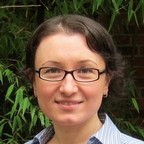

```{r setup, include=FALSE}
knitr::opts_chunk$set(echo = FALSE)

library(tidyverse)
library(fontawesome)
```

```{r joe, results="asis"}
# cat("
# <style>
# img {
#   border-radius: 50%;
#   width:100px
# }
# </style>
# ")

tibble(
  image = "",#"",
  name = "[**Joseph F. T. Nese, Ph.D.**](https://education.uoregon.edu/people/faculty/jnese)<a href='mailto:jnese@uoregon.edu'> <i class='fa fa-envelope'></i></a><br>Princial Investigator<br>",
  univ = ""
) %>% 
  knitr::kable(col.names = NULL)
```

Joe is a Research Associate Professor at [Behavioral Research and Teaching](https://www.brtprojects.org/) at the University of Oregon. He received his Ph.D. in school psychology from the University of Maryland, and his B.A from the University of California at Santa Barbara. His goal is to bridge assessment and intervention in a meaningful way; to provide access to reliable and relevant data, interpret student responsiveness to intervention, and offer instructional recommendations to teachers to increase student achievement. Joe was the Principal Investigator of [CORE](https://ies.ed.gov/funding/grantsearch/details.asp?ID=1492), a project to develop and validate a computerized assessment system of oral reading fluency that serves as the foundational work for CORE + Prosody.

As PI of CORE + Prosody, Joe is responsible for all aspects of the CORE + Prosody project. He serves as a data scientist for the project, and leads the Human-Rated Prosody and the Comprehension & Cognitive Load Studies.

----

```{r aki, results="asis"}
tibble(
  image = "",
  name = "[**Akihito Kamata, Ph.D.**]()<a href='mailto:akamata@smu.edu'> <i class='fa fa-envelope'></i></a><br>Co-Principal Investigator<br>",
  univ = ""
) %>% 
  knitr::kable(col.names = NULL)
```

Aki is a Professor in the Department of Education Policy & Leadership and the Department of Psyschology at Southern Methodist University. His primary research interest is psychometrics and educational and psychological measurement, focusing on development and implementation of item-level test data analysis methodology through various modeling framework, including item response theory, multilevel modeling, and structural equation modeling. Aki is also the Principal Investigator of a project to [Develop Computational Tools for Model-Based Oral Reading Fluency Assessments](https://ies.ed.gov/funding/grantsearch/details.asp?ID=3410).

As Co-PI of CORE + Prosody, Aki shares responsibility for all aspects of the project, and leads all psychometric modeling, including the study to measure and score prosody, and the calibration, equating, linking study.

----

```{r rhonda, results="asis"}
tibble(
  image = "",
  name = "[**Rhonda Nese, Ph.D.**](https://education.uoregon.edu/people/faculty/rnese)<a href='mailto:rnese@uoregon.edu'> <i class='fa fa-envelope'></i></a><br>Co-Principal Investigator<br>",
  univ = ""
) %>% 
  knitr::kable(col.names = NULL)
```

Rhonda is an Assistant Professor in the [Department of Special Education and Clinical Sciences](https://education.uoregon.edu/sped) and a Principal Investigator within [Educational and Community Supports](https://ecs.uoregon.edu/) at the UO. Her research involves equitable intervention delivery within a multi-tiered behavior support framework focused on preventative strategies for improving student outcomes. Rhonda is the PI on an [IES grant](https://ies.ed.gov/funding/grantsearch/details.asp?ID=2192) to refine and test an intervention to reduce exclusionary discipline practices, improve student behavior and student-teacher relationships, and increase instructional time for students in secondary settings, and Co-PI on three additional IES grants. 

Rhonda brings expertise in training educators on equitable and feasible instructional practices, systems change, and policy implementation to support their community of learners. As Co-PI of CORE + Prosody, Rhonda shares responsibility for all aspects of the project, and leads the Feasibility of Use study, ensuring CORE + Prosody is feasible, useful, and relevant for educators, and efficient and valuable for administrators.

----

```{r leilani, results="asis"}
tibble(
  image = "",
  name = "[**Leilani Sáez, Ph.D.**](https://education.uoregon.edu/people/faculty/lsaes)<a href='mailto:lsaez@uoregon.edu'> <i class='fa fa-envelope'></i></a><br>Co-Principal Investigator<br>",
  univ = ""
) %>% 
  knitr::kable(col.names = NULL)
```

Leilani is a Research Assistant Professor in the College of Education at the University of Oregon. She obtained her Ph.D. in Educational Psychology from the University of California, Riverside.She has been the Principal or Co-Principal Investigator of nearly \$3 million dollars in federally funded projects, and more than \$50,000 in internal funding, to support teachers’ assessment-guided decision-making for preventing reading difficulties and enhance children’s reading development.

Leilani has extensive experience working in classroom settings, particularly in the area of literacy instruction, including teaching, observation, and quantitative research. As Co-PI of CORE + Prosody, Leilani shares responsibility for all aspects of the project, leads the development of the reading comprehension questions, and co-leads the Comprehension & Cognitive Load Studies.

----

```{r julie, results="asis"}
tibble(
  image = "",
  name = "[**Julie Alonzo, Ph.D.**](https://education.uoregon.edu/people/faculty/jalonzo)<a href='mailto:jalonzo@uoregon.edu'> <i class='fa fa-envelope'></i></a><br>Assessment Systems<br>",
  univ = ""
) %>% 
  knitr::kable(col.names = NULL)
```

Julie earned her Ph.D. in Educational Leadership with a specialization in Learning Assessment / Systems Performance at the University of Oregon in 2007. She earned her B.A. in English from Carleton College in 1990, her NBPTS Certification in Adolescent and Young Adult English Language Arts, and worked as a high school teacher and part-time administrator for 12 years prior to her work at the UO. Julie is the Co-Director at [Behavioral Research and Teaching](https://www.brtprojects.org/), and the Director of the Doctorate of Education (D.Ed.) program at the UO. Her primary research interests include teacher and administrator professional development and the meaningful inclusion of students with diverse learning needs.

With expertise in curriculum-based measurement and teacher professional development, Julie provides guidance on the CORE + Prosody assessment development, and the prosody training for the Human-Rated Prosody study.

----

```{r eric, results="asis"}
tibble(
  image = "",
  name = "[**Eric Larson, Ph.D.**](https://s2.smu.edu/~eclarson/index.html)<a href='mailto:eclarson@lyle.smu.edu'> <i class='fa fa-envelope'></i></a><br>Computer Engineering<br>",
  univ = ""
) %>% 
  knitr::kable(col.names = NULL)
```

Eric is an Associate Professor in Computer Science in the Bobby B. Lyle School of Engineering, Southern Methodist University. He is a fellow of the Hunt Institute for Engineering Humanity, a member of the Darwin Deason Institute for Cyber-security, and a member of the ATT center for virtualization. His research explores the interdisciplinary relationship of machine learning and signal/image processing with the fields of security, mobile health, education, psycho-visual psychology, human-computer interaction, and ubiquitous computing. 

As the Computer Engineer for CORE + Prosody, Dr. Larson is responsible for developing the project's prosody algorithm, ASR engine, and tablet application.

----

```{r nelis, results="asis"}
tibble(
  image = "",
  name = "[**Cornelis Potgieter, Ph.D.**](http://www.cjpotgieter.com/)<a href='mailto:c.potgieter@tcu.edu'> <i class='fa fa-envelope'></i></a><br>Statistics Consultant<br>",
  univ = ""
) %>% 
  knitr::kable(col.names = NULL)
```

Cornelis received his Ph.D. in Statistics from the University of Johannesburg in 2009. He is currently an Assistant Professor in the Department of Mathematics at Texas Christian University, and also holds an appointment as Visiting Senior Research Associate in the Department of Statistics at the University of Johannesburg, South Africa. His primary research interests are nonparametric statistics and educational (psychometric) measurement, focusing on the development of new methodology in the areas of treatment effect estimation, measurement error & latent variable modeling, and capturing asymmetry in data using generalized skew-symmetric distributions. 

Cornelis will consult with CORE + Prosody investigators to help derive the parameter estimation algorithm for the integrated psychometric model for prosody, accuracy, and rate parameters. 

----

```{r george, results="asis"}
tibble(
  image = "",
  name = "**George Sammit, M.S.**<a href='mailto:gsammit@mail.smu.edu'> <i class='fa fa-envelope'></i></a><br>Machine Learning<br>",
  univ = ""
) %>%
  knitr::kable(col.names = NULL)
```

George is a Principal Computer Scientist with the Intelligent Systems Division of the Southwest Research Institute, and a Computer Science Ph.D. student in the Bobby B. Lyle School of Engineering at the Southern Methodist University.  His research focuses on software engineering methods and processes, software engineering economics, and managing software projects.
 
Working with Dr. Larson and fellow researchers at SMU, George developed the prosody classification models for the CORE + Prosody project, the results of which he presented at the [2022 IEEE International Conference on Acoustics, Speech and Signal Processing](https://jnese.github.io/coreprosody/dissemination.html).

----

```{r zhongdi, results="asis"}
tibble(
  image = "",
  name = "**Zhongdi Wu, M.S.**<a href='mailto:zhongdiw@mail.smu.edu'> <i class='fa fa-envelope'></i></a><br>Machine Learning<br>",
  univ = ""
) %>%
  knitr::kable(col.names = NULL)

```

Zhongdi is a computer science PhD student at the Lyle School of Engineering at Southern Methodist University. He received a bachelor’s degree in Electric Engineering in Automation Control from North China Electric Power University and a master’s degree of Computer Science from Southern Methodist University. He is interested in machine learning, pattern recognition, and deep learning. He is currently working on several deep learning related projects.

----

```{r xinyi, results="asis"}
tibble(
  image = "",
  name = "**Xinyi Ding, Ph.D.**<a href='mailto:xding@mail.smu.edu'> <i class='fa fa-envelope'></i></a><br>Machine Learning<br>",
  univ = ""
) %>% 
  knitr::kable(col.names = NULL)
```

Xinyi is an Assistant Professor in the Department of Computer Science and Technology at ZheJiang GongShang University. He received his Ph.D. from Southern Methodist University in 2020. His research interests include ubiquitous computing, machine learning, and educational data mining.

----

```{r noboru, results="asis"}
tibble(
  image = "",
  name = "[**Noboru Matsuda, Ph.D.**](https://people.engr.ncsu.edu/nmatsud/)<a href='mailto:noboru.matsuda@ncsu.edu'> <i class='fa fa-envelope'></i></a><br>Artificial Intelligence Consultant<br>",
  univ = ""
) %>% 
  knitr::kable(col.names = NULL)
```

Noboru is an Associate Professor of Computer Science and a Director of the Innovative Educational Computing Laboratory at North Carolina State University, whose research focus is on technology innovation and integration to of Artificial Intelligence technologies to advance the sciences of learning. Noboru was awarded an IES grant to develop an online learning environment to learn to solve liner algebra equations by teaching a synthetic peer (aka a teachable agent), called SimStudent, and an intervention called APLUS (Artificial Peer Learning environment Using SimStudent). His scholarly expertise spans education, learning science, cognitive science, and computer science.

Noboru will consult with CORE + Prosody investigators on the machine learning aspects of the Automated Prosody Scoring Study (e.g., feature selection, convolutional network) and the automatic speech recognition (ASR) Development. 

----

```{r gulcan, results="asis"}
tibble(
  image = "",
  name = "[**Gulcan Cil, Ph.D.**](http://www.ori.org/scientists/gulcan_cil)<br>Cost Analysis Consultant<br>",
  univ = ""
) %>% 
  knitr::kable(col.names = NULL)
```

Gulcan is a health economist with a particular focus on policy impact evaluation and identification of the effects of behavioral and environmental factors on health and other socio-economic outcomes. Her research expertise is in analyses of large data sets from administrative records using modern statistical techniques for improved causal inference. She has extensive experience in large-scale policy evaluation in terms of behavioral responses they induce and their impacts on individual outcomes. She has also participated in cost studies for school-based programs, and studies that involve population-level evaluation of school- or community-based programs.

Gulcan will consult with CORE + Prosody investigators on Cost Analysis, ensuring the adequate collection of resources needed for the “ingredients approach”, information tracking, and analysis consultation. 

----

```{r aaron, results="asis"}
tibble(
  image = "",
  name = "[**Aaron Glasgow**](https://education.uoregon.edu/people/faculty/aglasgow)<br>Technology Development<br>",
  univ = ""
) %>% 
  knitr::kable(col.names = NULL)
```

Aaron has extensive experience in software engineering with a focus on full-stack web application development for the K-12 environment. Aaron has served as the technical coordinator and lead developer on many federal grants and state contracts. Aaron routinely communicates with diverse audiences of varying technical background and helps to achieve functional outcomes. He has made significant contributions to the easyCBM assessment system and several alternate/extended assessment systems used to meet statewide k-12 accountability requirements. 

For CORE + Prosody, Aaron is responsible for managing and developing the software for the Human-Rated Prosody study, ensuring the technical adequacy of data collection, and collaborating wih SMU on the tablet application development.

----

```{r makayla, results="asis"}
tibble(
  image = "",
  name = "**Makayla Whitney**<a href='mailto:mwhitney@uoregon.edu'> <i class='fa fa-envelope'></i></a><br>Graduate Researcher<br>",
  univ = ""
) %>% 
  knitr::kable(col.names = NULL)
```

Makayla is a master's student in the department of Educational Methodology, Policy, and Leadership at the University of Oregon. Her thesis is focused on creating a reading assessment for illiterate adults that includes aspects of comprehension. She received her a bachelor's degree from Humboldt State University in Anthropology with focuses in Linguistics and Teaching English as a Second Language (ESL). Her background is in adult literacy, ESL studies, adult assessments, and reading materials.

For CORE + Prosody, Makayla assisted with the development of the prosody rubric and worked as a prosody rater in the [Human Rated Prosody Study](https://jnese.github.io/coreprosody/human_prosody_scoring.html#prosody-rating-procedures). 